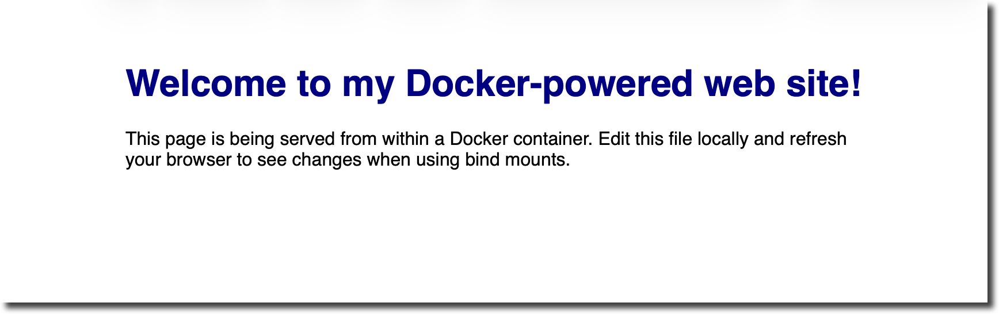
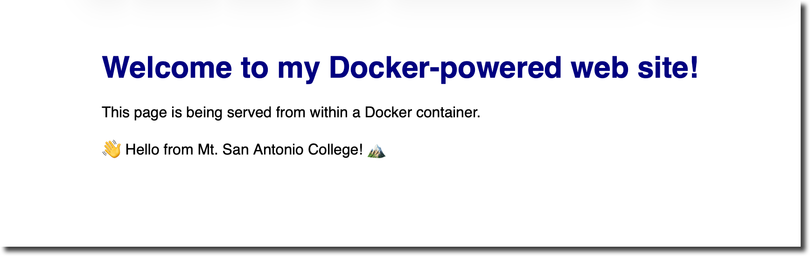
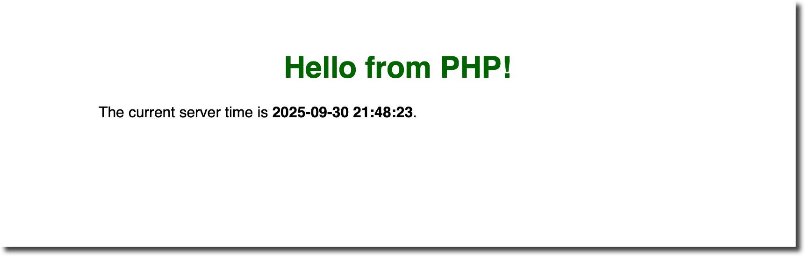
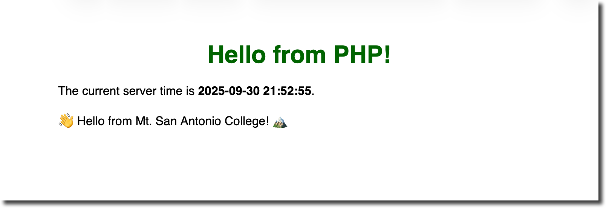

# DOCKER01 – Simple Docker Web Server & PHP

This tutorial introduces Docker as a flexible development tool.  You will learn how to run a basic static web server in a container, add PHP support on top of it, and use bind mounts to edit files locally while the container is running.  Each step is broken down with explanations, commands and sample files.

## Objectives

- Build a minimal Docker image for serving a single HTML page.
- Understand **Docker images**, **containers** and **ports**. 
- Use **bind mounts** for live editing of project files. 
- Extend the static server with **PHP** using the official `php:apache` image.
- Learn the basics of port mapping and volumes by running containers on a host port so you can access them via `localhost`.

**Tools Needed**

* [**Docker**](https://www.docker.com) installed on your system (Docker Desktop or the Docker Engine)
* A **terminal** or command‑line shell
* A [code editor](code-editors.html)
* A **web browser** to view your pages


## What is Docker?

Docker is a containerization platform.  A **Docker image** is like a blueprint or class: it defines everything needed (code, runtime, libraries) to run an application. Images are immutable and ensure that the same environment runs on every machine.  A **container** is the running instance of an image; you can start, stop, or delete containers using the Docker CLI.  Containers are isolated from each other and the host, so you must explicitly expose ports to access services.

## Step 1 – Project Setup

Create a working folder called `docker‑webserver`.  Inside this folder make a `site-content` directory for your website files.  Then create a simple `index.html` page in `site-content` with some placeholder content.

```html
<!-- docker‑webserver/site-content/index.html -->
<!DOCTYPE html>
<html lang="en">
<head>
  <meta charset="UTF-8">
  <title>Docker Web Server</title>
  <style>
    body { font-family: sans-serif; max-width: 640px; margin: 0 auto; padding: 2rem; }
    h1 { color: navy; text-align: center; }
  </style>
</head>
<body>
  <h1>Welcome to my Docker‑powered web site!</h1>
  <p>This page is being served from within a Docker container.  Edit this file locally and refresh your browser to see changes when using bind mounts.</p>
</body>
</html>
```

## Step 2 – Create a Dockerfile for a static site

To run a web server we need an image.  We will use the lightweight **Nginx** image (`nginx:1‑alpine`) from Docker Hub.  Create a file named `Dockerfile` in `docker‑webserver` with the following contents:

```dockerfile
# docker‑webserver/Dockerfile

# Use the official Nginx image as a base.  The `alpine` tag reduces size.
FROM nginx:1-alpine

# Copy the website files into the Nginx document root
COPY site-content/ /usr/share/nginx/html

# Expose port 80 (the default Nginx port)
EXPOSE 80

CMD ["nginx", "-g", "daemon off;"]
```

**Explanation:**

- `FROM nginx:1-alpine` tells Docker to start from the official Nginx image.  The `1-alpine` variant is small and includes an Alpine Linux base.
- `COPY site-content/ /usr/share/nginx/html` copies your local `site-content` folder into the container’s default document root.  When Nginx starts, it will serve the HTML page we created.
- `EXPOSE 80` declares that the container listens on port 80, but it doesn’t publish it.  We will publish a host port when we run the container.

## Step 3 – Build and run the static site

Open a terminal and navigate to the `docker‑webserver` directory.  Run the following command to build the image and tag it as `simple-webserver`:

```sh
docker build -t simple-webserver .
```

After the build completes, run a container in detached mode (background) and map your host’s port 8080 to the container’s port 80:

```sh
docker run -d --name simple-webserver -p 8080:80 simple-webserver
```

The `-p 8080:80` option publishes port 80 inside the container to port 8080 on the host.  Without publishing a port, the service is inaccessible from the host due to container isolation.  Open a browser and navigate to `http://localhost:8080` – you should see your welcome page.



To stop and remove the container when you’re done, run:

```sh
docker rm -f simple-webserver
```

## Step 4 – Live editing with bind mounts

Rebuilding the image every time you change a file is inefficient during development.  Instead, use a **bind mount** to share your project directory with the container.  Bind mounts let the container see file changes immediately.

From inside `docker‑webserver` run the following command:

```sh
docker run -d --name dev-webserver -p 8080:80 \
  --mount type=bind,src="$(pwd)/site-content",target=/usr/share/nginx/html \
  nginx:1-alpine
```

This command mounts your local `site-content` directory into the container’s document root.  Now whenever you edit `index.html`, refreshing the browser will show your changes instantly.  When you’re finished, remove the container with `docker rm -f dev-webserver`.



### Bind mounts vs volumes

Docker supports two types of mounts: **bind mounts** and **volumes**.  A bind mount shares a specific host directory with the container; you decide the host path, and changes propagate in both directions. Volumes are managed by Docker and live outside the host filesystem, which is useful for storing persistent data but not ideal for editing source code. In development scenarios, bind mounts provide a fast feedback loop.

## Step 5 – Add PHP support

Static pages are limiting; let’s extend the container to process PHP scripts.  The **official `php:apache` image** includes PHP and the Apache HTTP Server, allowing you to serve dynamic pages out of the box.  The Docker guide notes that you can containerize a PHP application and serve it via Apache.  We’ll create a new `php-webserver` image based on this.

1. **Create a project folder.**  Inside `docker‑webserver` create `php-site` and place an `index.php` file inside:

   ```php
   <!-- docker‑webserver/php-site/index.php -->
   <?php
     $currentTime = date('Y-m-d H:i:s');
   ?>
   <!DOCTYPE html>
   <html lang="en">
   <head>
     <meta charset="UTF-8">
     <title>Docker PHP Server</title>
     <style>
       body { font-family: sans-serif; max-width: 640px; margin: 0 auto; padding: 2rem; }
       h1 { color: darkgreen; text-align: center; }
     </style>
   </head>
   <body>
     <h1>Hello from PHP!</h1>
     <p>The current server time is <strong><?php echo $currentTime; ?></strong>.</p>
   </body>
   </html>
   ```

2. **Write a PHP Dockerfile.**  In `docker‑webserver` create a `Dockerfile.php` with the following contents:

   ```dockerfile
   # docker‑webserver/Dockerfile.php

   # Use the official PHP image that bundles Apache
   FROM php:8.2-apache

   # Copy the PHP site into Apache's document root
   COPY php-site/ /var/www/html/

   # Enable any PHP extensions you need; for example, mysqli or pdo_mysql
   RUN docker-php-ext-install pdo pdo_mysql

   EXPOSE 80

   CMD ["apache2-foreground"]
   ```

   The `php:8.2-apache` image combines a Debian base, Apache web server and PHP 8.2.  The Docker guide’s **docker init** workflow selects *“PHP with Apache”* and version 8.2, which is exactly what we are using.  The `RUN docker-php-ext-install` line demonstrates how to enable additional PHP extensions if your project needs a database driver; you can remove it for a simple site.

3. **Build and run the PHP container.**  Build the new image and run it on port 8081:

   ```sh
   docker build -t php-webserver -f Dockerfile.php .

   docker run -d --name php-webserver -p 8081:80 php-webserver
   ```

4. **Visit the PHP site.**  Open your browser to `http://localhost:8081/index.php`.  You should see “Hello from PHP!” and the current time.  To stop the container, run `docker rm -f php-webserver`.



### Modifying PHP configuration

You can mount your `php-site` directory into the PHP container using a bind mount to see changes instantly:

```sh
docker run -d --name php-dev -p 8081:80 \
  --mount type=bind,src="$(pwd)/php-site",target=/var/www/html \
  php:8.2-apache
```

This command uses the official `php:8.2-apache` image directly and mounts the local `php-site` folder into `/var/www/html`.  Edit `index.php` and refresh the browser to see updates.



## Step 6 – Organize with Docker Compose (optional)

For multi‑service applications you can use **Docker Compose**.  Compose lets you define services, networks and volumes in a single YAML file and bring them up with one command.  In the Nginx example earlier, a Compose file defined a service, selected the `nginx:1‑alpine` image, mapped ports and mounted a directory.  Compose files also support multiple services and dependencies (for example, Nginx plus a backend API).

To adapt our PHP example to Compose, create a `docker-compose.yml`:

```yaml
version: '3.8'
services:
  php:
    image: php:8.2-apache
    ports:
      - '8082:80'
    volumes:
      - ./php-site:/var/www/html
```

Then run `docker compose up -d` to start the service and `docker compose down` to stop it.  Compose automatically handles port mapping and mount configuration, making it easier to manage complex setups.

## Summary

In this tutorial you built a static website with Docker, learned the difference between images and containers, used bind mounts for live development, and extended the environment to serve PHP files.  With these skills you can start containerizing your own web projects and confidently evolve them using Docker’s flexible toolset.
