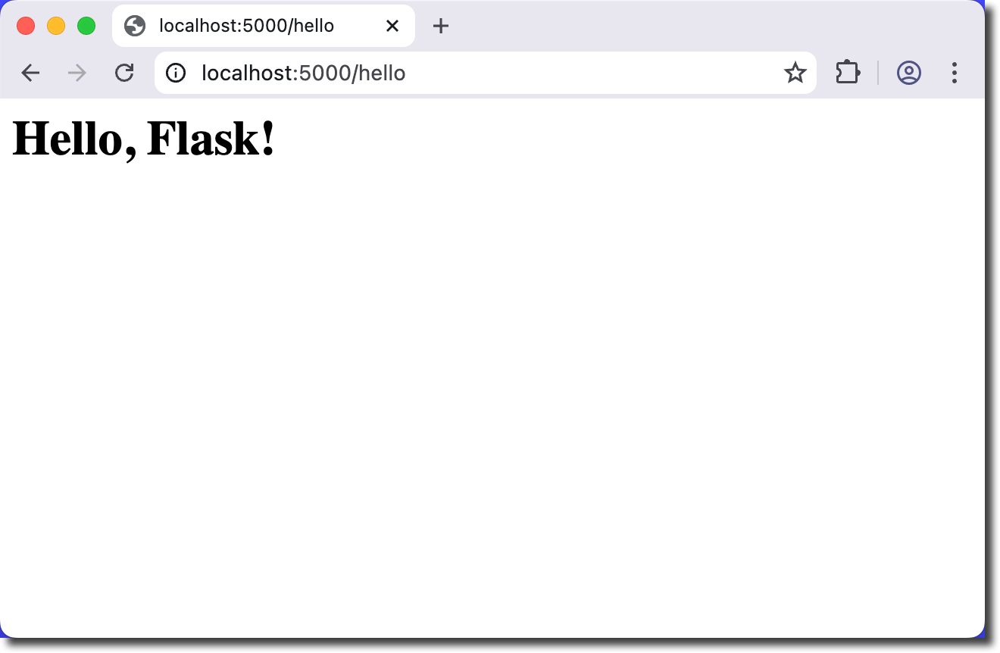
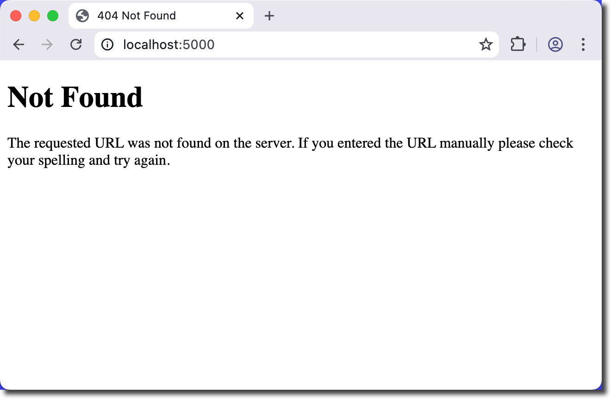
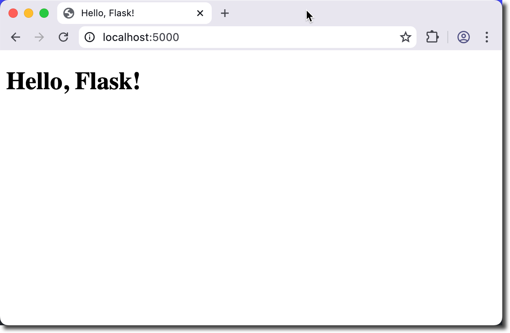
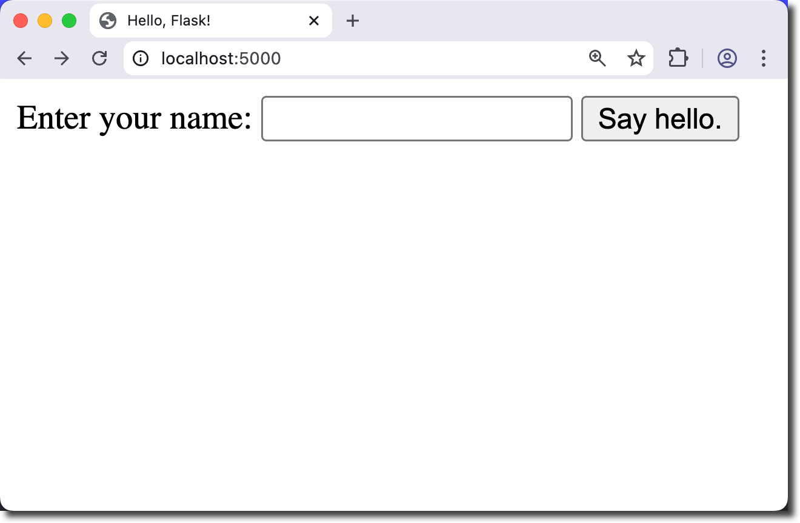
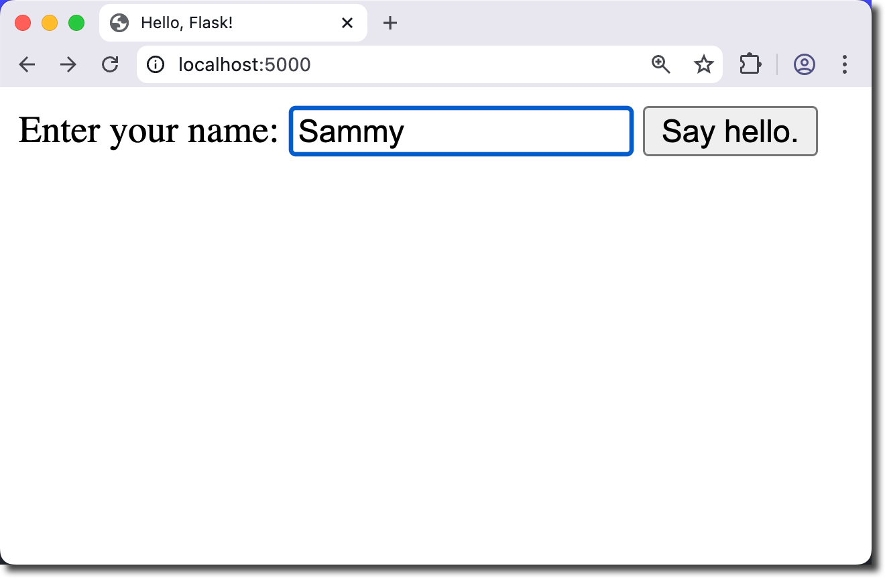
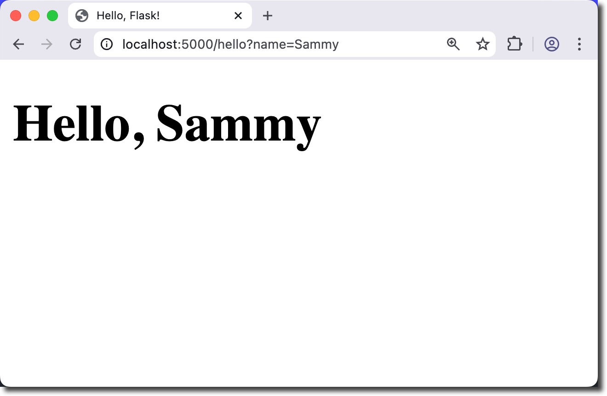

# Hello, Flask

**Objectives**

Build a Hello, World web application using Flask.

**Tools Needed**

You will need a [code editor](code-editors.html), a web browser, [Python 3](https://python.org), and [Flask](https://flask.palletsprojects.com/).

## Flask Setup

> Flask is a lightweight WSGI web application framework. It is designed to make getting started quick and easy, with the ability to scale up to complex applications. From the [Flask User Guide](https://flask.palletsprojects.com/en/stable/#user-s-guide).

Create a working folder named **hello-flask** and open it in your editor.

Create two files in the directory:

1. requirements.txt
2. app.py

We will list required packages in **requirements.txt** and build our application in **app.py**.

This project only requires flask. Add the following line to **requirements.txt**:

`Flask`

Open **app.py** and enter the following:

<pre><code>
from flask import Flask

app = Flask(__name__)

@app.route("/hello")
def hello_world():
    return "&lt;h1&gt;Hello, Flask!&lt;/h1&gt;"
</code></pre>

What does this code do?

- **from flask import Flask**: Import the Flask class
- **app = Flask(__name__)**: Assigns this file as the flask application
- **@app.route("/hello")**: Create a route for the browser at /hello. E.g. localhost:5000/hello
- **def hello_world():** This function returns the code when the browser opens the route

Notice that the **@decorator** is used in flask to indicate a specific route (/hello). The function immediately following the route will be triggered.

## Run the Flask Application

Open the terminal in your editor (or manually in your project directory).

Make sure you have flask installed.

`pip install -r requirements.txt`

Start the flask server by entering `flask run` in the terminal.

The server status will display:

<pre>
hello-flask % flask run
 * Debug mode: off
WARNING: This is a development server. Do not use it in a production deployment. Use a production WSGI server instead.
 * Running on http://127.0.0.1:5000
Press CTRL+C to quit
</pre>

You will be able to see what is going on with the server from this log.

Open your browser to `http://localhost:5000/hello`.

This is your local machine (e.g. 127.0.0.1) using port 5000 to open /hello.

You should see your flask application running in the browser.

You will see a log entry in the terminal as well.

<pre>127.0.0.1 - - [14/Nov/2025 12:10:42] "GET /hello HTTP/1.1" 200 -</pre>

Did you get an error? If you tried to open the URL without **/hello** you will get the error page.

You also see the **404** error in the log:

<pre>127.0.0.1 - - [14/Nov/2025 12:14:06] "GET / HTTP/1.1" 404 -</pre>

What is http code 404?

There are several http codes that you might want to be familiar with.

<table border="1" cellpadding="6" cellspacing="0">
  <thead>
    <tr>
      <th>Code</th>
      <th>Meaning</th>
      <th>Description</th>
    </tr>
  </thead>
  <tbody>
    <tr>
      <td>200</td>
      <td>OK</td>
      <td>Request succeeded.</td>
    </tr>
    <tr>
      <td>201</td>
      <td>Created</td>
      <td>New resource successfully created.</td>
    </tr>
    <tr>
      <td>204</td>
      <td>No Content</td>
      <td>Request succeeded, no response body.</td>
    </tr>
    <tr>
      <td>301</td>
      <td>Moved Permanently</td>
      <td>Resource has been permanently moved to a new URL.</td>
    </tr>
    <tr>
      <td>302</td>
      <td>Found</td>
      <td>Temporary redirect to another URL.</td>
    </tr>
    <tr>
      <td>304</td>
      <td>Not Modified</td>
      <td>Cached version is still valid; no new data.</td>
    </tr>
    <tr>
      <td>400</td>
      <td>Bad Request</td>
      <td>Request is malformed or invalid.</td>
    </tr>
    <tr>
      <td>401</td>
      <td>Unauthorized</td>
      <td>Authentication required or failed.</td>
    </tr>
    <tr>
      <td>403</td>
      <td>Forbidden</td>
      <td>Request understood but not allowed.</td>
    </tr>
    <tr>
      <td>404</td>
      <td>Not Found</td>
      <td>Resource not found.</td>
    </tr>
    <tr>
      <td>405</td>
      <td>Method Not Allowed</td>
      <td>HTTP method not supported by the resource.</td>
    </tr>
    <tr>
      <td>409</td>
      <td>Conflict</td>
      <td>Request conflicts with current state of the server.</td>
    </tr>
    <tr>
      <td>429</td>
      <td>Too Many Requests</td>
      <td>Rate limit exceeded.</td>
    </tr>
    <tr>
      <td>500</td>
      <td>Internal Server Error</td>
      <td>Generic server-side failure.</td>
    </tr>
    <tr>
      <td>502</td>
      <td>Bad Gateway</td>
      <td>Upstream server returned an invalid response.</td>
    </tr>
    <tr>
      <td>503</td>
      <td>Service Unavailable</td>
      <td>Server temporarily unable to handle the request.</td>
    </tr>
    <tr>
      <td>504</td>
      <td>Gateway Timeout</td>
      <td>Upstream server took too long to respond.</td>
    </tr>
  </tbody>
</table>

There is no route in our application for the root directory, **"/"**. Let's create one.

### Adding a Route

Stop your flask server by typing CTRL+C in the terminal.

Create a "homepage" at the route **"/"** with a form to enter a name. Then the page will redirect to **"/hello"**.

We will flasks built-in template engine to show the html file. 

Import **render_template** and then use it to return **index.html**.

Edit **app.py**

<pre><code>
from flask import Flask, render_template

app = Flask(__name__)

@app.route("/")
def index():
    return render_template("index.html")

@app.route("/hello")
def hello_world():
    return "&lt;h1&gt;Hello, Flask!&lt;/h1&gt;"
</code></pre>

We have added:

- **render_template** imports the flask templating engine
- **@app.route("/")**: Tells flask what to do when the base URL is opened
- **return render_template("index.html")**: Tells flask to look for the template file named index.html.

Flask templates let you separate HTML from Python logic by using Jinja2 files in a **templates/** folder, where you pass data from your routes into template files rendered with `render_template()`.

Create the **templates/** directory.

`mkdir templates`

The project folder should look like this now:

<pre>
.hello-flask
├── app.py
├── requirements.txt
└── templates
</pre>

Inside the templates folder, create a [basic html page](web00-basic-html.html) named **index.html** with a **title** and an **h1** that contain "Hello, Flask!".

Use the `flask run` command and open your browser to `http://localhost:5000`

You should see **index.html**.

We now have 2 working routes that display similar output. 

### Getting and Displaying User Input

We will change **index.html** to be a form that asks you to enter your name.

Then we will route to **"/hello"** and display a custom message.

Stop your flask server by typing CTRL+C in your terminal.

**Update index.html**

Remove the **h1** and enter this simple form into the body tag.

<pre><code>
&lt;form action="/hello" method="GET"&gt;
    Enter your name:
    &lt;input name="name" type="text" autofocus autocomplete="off"&gt;
    &lt;button type="Submit"&gt;Say hello.&lt;/button&gt;
&lt;/form&gt;
</code></pre>

- `action="/hello"`: Send a GET request to the **/hello** route
- `<input name="name" type="text" autofocus autocomplete="off">`: Accept text input. This input has name of "name".
- `<button type="Submit">Say hello.</button>`: Submit button to send the GET request.

What is a GET request?

A GET request retrieves data from the server using URL parameters and does not change server state, while a POST request sends data in the request body to create or modify resources on the server.

GET requests send the data in the URL - it's visible to the user. For example:

<pre>http://localhost:5000/hello/?name=Sammy</pre>

Restart flask by pressing the up arrow or typing `flask run` into the terminal.

The **Say hello** button will direct the browser to the correct route, but it isn't using the name yet. You will still see the **h1** from the route in **app.py**.

### Create hello.html

Update the **"/hello"** route to return a webpage named **hello.html**.

<pre><code>
@app.route("/hello")
def hello_world():
    return render_template("hello.html")
</code></pre>

Create a file named **hello.html** in the **templates** directory. You can use the [basic html page](web00-basic-html.html) as a guide.

Add a **title** and an **h1** that contain "Hello, Flask!".

Restart flask by typing the up arrow or `flask run` in the terminal. Refresh the browser page.

The project directory looks like this currently:

<pre>
.hello-flask
├── app.py
├── requirements.txt
└── templates
    ├── hello.html
    └── index.html
</pre>

Fix any errors that you may find before continuing.

*Why aren't we seeing the name we entered in the hello file?*

### Sanitize and Pass User Data

We are ready to GET the name value passed from **index.html**. We will use python to assign the **name** value to a variable and pass that to **hello.html**. We display that value in html with `{{ name }}`.

<pre>
 ┌──────────────┐        GET name         ┌───────────────────────┐
 │  index.html  │ ----------------------> │    Flask Route        │
 └──────────────┘                         │  name = request.args  │
                                          │  render_template()    │
                                          └─────────┬─────────────┘
                                                    │ passes name
                                                    ▼
                                          ┌───────────────────────┐
                                          │     hello.html        │
                                          │  displays {{ name }}  │
                                          └───────────────────────┘

</pre>

We *must* sanitize all user-provided data. Values rendered in the output must be escaped to protect from injection attacks.

Stop your flask server if it is running by typing CTRL+C in the terminal.

Add an import for **escape** and **request** in **app.py**

<pre><code>
from flask import Flask, render_template, request
from markupsafe import escape
</code></pre>

- **request**: lets you access incoming data from the client
- **escape**:safely converts special characters to HTML entities to prevent code injection

Update the **hello()** function to:

- Check if **name** is in the GET request and assign that value to **name**
- Assign **World** if there is no value
- pass the escaped **name** to hello.html

Update to this:

<pre><code>
@app.route("/hello")
def hello():
    if request.args.get('name'):
        name = request.args.get('name')
    else:
        name = "World"
    return render_template( "hello.html", name=escape(name) )
</code></pre>

Now python will send the name typed into the form on index.html to a variable available to hello.html. This will display in the URL.

`http://localhost:5000/hello/?name=Sammy`

Update **hello.html** to use the Jinja variable `{{ name }}`.

Change the **h1** as follows:

<pre><code>
&lt;h1&gt;Hello, {{ name }}&lt;/h1&gt;
</code></pre>

Save the file. Start flask by typing the up arrow or `flask run` in the terminal.

Test your code several times with both a blank value (to test for World) and various names.

Here is the complete **app.py** code:

<pre><code>
from flask import Flask, render_template, request
from markupsafe import escape

app = Flask(__name__)

@app.route("/")
def index():
    return render_template("index.html")

@app.route("/hello")
def hello():
    if request.args.get('name'):
        name = request.args.get('name')
    else:
        name = "World"
    return render_template( "hello.html", name=escape(name) )
</code></pre>

🎉 Congratulations, you have built a flask app. 🎉

## Going Further

- Use jinja templates instead of typing basic html in every page
- Add `/static/` files for CSS and images
- Try using `POST` instead of `GET` to pass data to the server
- Store persistent data in `sqlite3`

<a href="#top">Back to top.</a>
