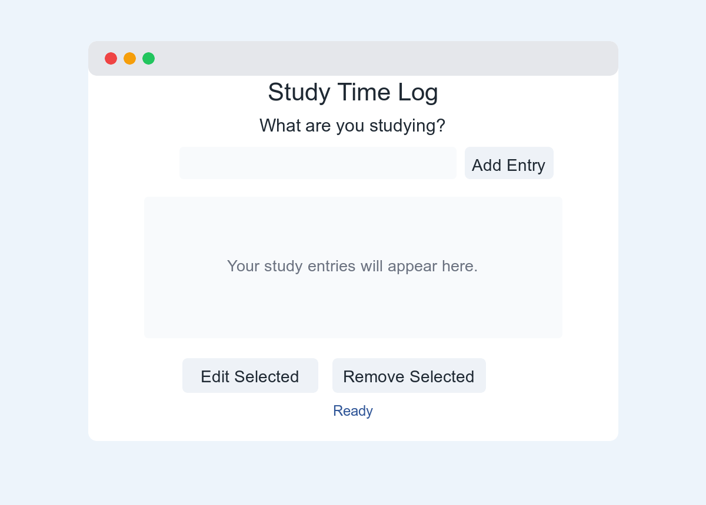
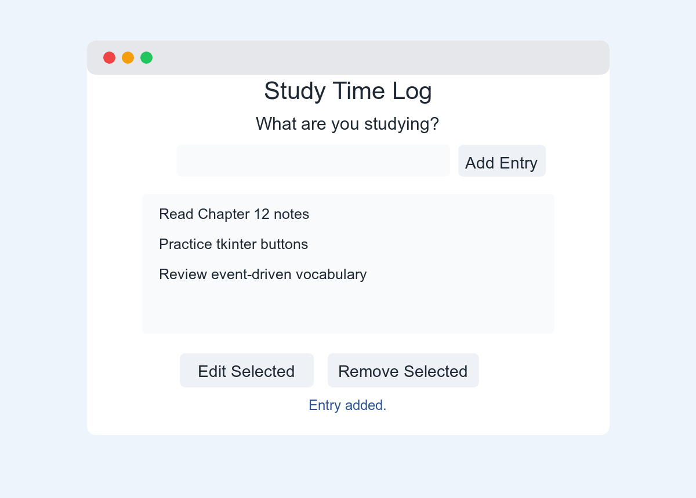
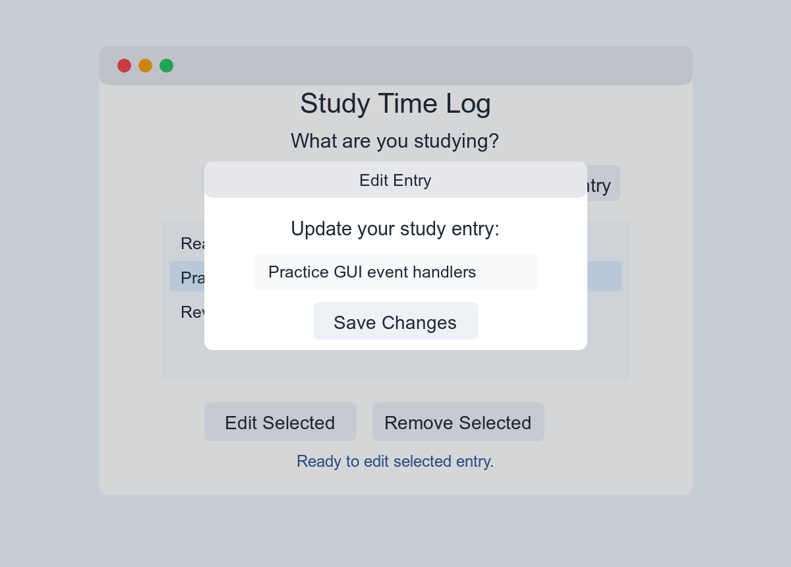
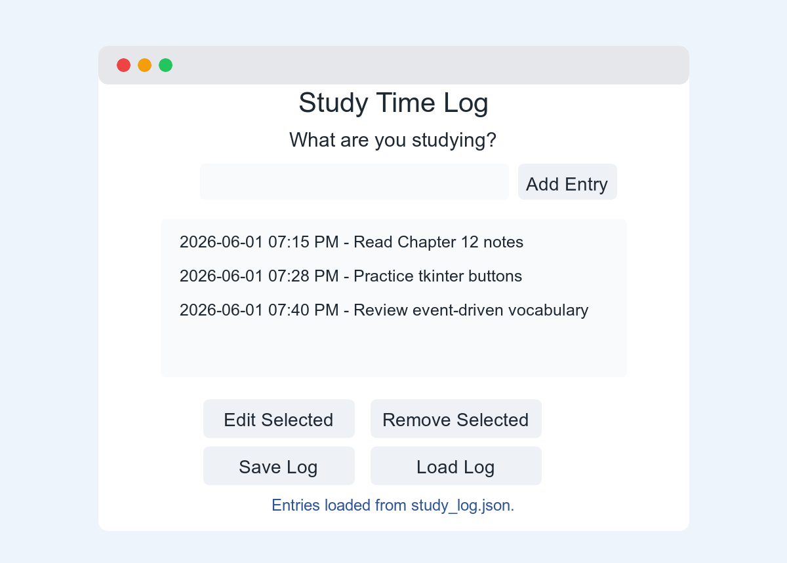

## Build a Python Study Time Log

You will build a small graphical user interface, or GUI, with Python and `tkinter`. The app will let you type what you are studying, add it to a study log, edit an entry in a popup window, and remove entries you no longer need.

  
<strong>Estimated time:</strong> 45 to 60 minutes

  
<strong>Goal:</strong> Practice event-driven programming by writing functions that respond when the user clicks buttons or selects items.

## What You Will Build

Your first version will keep entries only while the program is open. When you close the app, the entries disappear. After that, you will add a challenge feature that saves and loads entries with a JSON file.

<table style="border-collapse: collapse; width: 100%; margin: 16px 0;">
  <caption style="text-align: left; font-weight: bold; padding-bottom: 0.5rem;">You Will Practice</caption>
  <thead>
    <tr style="background: #2f5597; color: #ffffff;">
      <th scope="col" style="border: 1px solid #2f5597; padding: 10px; text-align: left;">Chapter idea</th>
      <th scope="col" style="border: 1px solid #2f5597; padding: 10px; text-align: left;">Where you will see it</th>
    </tr>
  </thead>
  <tbody>
    <tr>
      <td style="border: 1px solid #d6e9f8; padding: 10px;">Event-driven programming</td>
      <td style="border: 1px solid #d6e9f8; padding: 10px;">Button clicks call functions such as <code>add_entry</code>, <code>remove_entry</code>, and <code>edit_entry</code>.</td>
    </tr>
    <tr style="background: #f5faff;">
      <td style="border: 1px solid #d6e9f8; padding: 10px;">GUI components</td>
      <td style="border: 1px solid #d6e9f8; padding: 10px;">The app uses a window, labels, an entry box, buttons, a listbox, and a popup window.</td>
    </tr>
    <tr>
      <td style="border: 1px solid #d6e9f8; padding: 10px;">GUI design issues</td>
      <td style="border: 1px solid #d6e9f8; padding: 10px;">The app uses larger text, clear labels, spacing, and feedback messages so it is easier to read.</td>
    </tr>
    <tr style="background: #f5faff;">
      <td style="border: 1px solid #d6e9f8; padding: 10px;">Developing an event-driven app</td>
      <td style="border: 1px solid #d6e9f8; padding: 10px;">You will build the app one feature at a time and test after each major change.</td>
    </tr>
  </tbody>
</table>

## Part 0: Set Up Your Project

Create a new folder for this activity. Then create and activate a virtual environment.

<strong>Mac or Linux:</strong>

<pre><code>
mkdir study-time-log
cd study-time-log
python3 -m venv .venv
source .venv/bin/activate
python --version</code></pre>

<strong>Windows:</strong>

<pre><code>
mkdir study-time-log
cd study-time-log
py -m venv .venv
.venv\Scripts\activate
python --version</code></pre>

Create a new file named `study_time_log.py`.

  
<strong>Note:</strong> <code>tkinter</code> usually comes with Python. If your computer says <code>No module named tkinter</code> or <code>No module named _tkinter</code>, ask for help before continuing. You may need a different Python installation.

## Part 1: Build the Basic App

In Part 1, the app can add, edit, and remove entries. The entries are stored in memory, which means they disappear when the program closes. That is normal for this first version.

### Step 1: Import tkinter and create the window

Add this code to `study_time_log.py`:

<pre><code>
import tkinter as tk
from tkinter import messagebox

root = tk.Tk()
root.title("Study Time Log")
root.geometry("720x520")

BIG_FONT = ("Arial", 18)
TITLE_FONT = ("Arial", 24, "bold")

root.mainloop()</code></pre>

Run the program:

<pre><code>python3 study_time_log.py</code></pre>

You should see a blank window. Close the window before you move to the next step.

### Step 2: Add labels, an entry box, buttons, and a listbox

Replace your file with this starter layout. This version creates the visible parts of the GUI.

<pre><code>
import tkinter as tk
from tkinter import messagebox

root = tk.Tk()
root.title("Study Time Log")
root.geometry("720x520")

BIG_FONT = ("Arial", 18)
TITLE_FONT = ("Arial", 24, "bold")

title_label = tk.Label(root, text="Study Time Log", font=TITLE_FONT)
title_label.pack(pady=15)

instruction_label = tk.Label(root, text="What are you studying?", font=BIG_FONT)
instruction_label.pack()

entry_box = tk.Entry(root, font=BIG_FONT, width=35)
entry_box.pack(pady=10)

add_button = tk.Button(root, text="Add Entry", font=BIG_FONT)
add_button.pack(pady=5)

log_listbox = tk.Listbox(root, font=BIG_FONT, width=45, height=8)
log_listbox.pack(pady=15)

button_frame = tk.Frame(root)
button_frame.pack()

edit_button = tk.Button(button_frame, text="Edit Selected", font=BIG_FONT)
edit_button.grid(row=0, column=0, padx=8)

remove_button = tk.Button(button_frame, text="Remove Selected", font=BIG_FONT)
remove_button.grid(row=0, column=1, padx=8)

status_label = tk.Label(root, text="Ready", font=("Arial", 14))
status_label.pack(pady=15)

root.mainloop()</code></pre>

Run the program again. You should now see the main layout.

### Step 3: Make the Add Entry button work

Buttons do not do anything by themselves. In a GUI program, you write a function and connect the button to that function.

Add this function above the line that creates `title_label`:

<pre><code>
def add_entry():
    study_text = entry_box.get().strip()

if study_text == "":
    status_label.config(text="Type an entry first.")
    return

log_listbox.insert(tk.END, study_text)
entry_box.delete(0, tk.END)
status_label.config(text="Entry added.")</code></pre>

Then change your `add_button` line so it includes `command=add_entry`:

<pre><code>add_button = tk.Button(root, text="Add Entry", font=BIG_FONT, command=add_entry)</code></pre>

Run the program. Type something into the entry box and click **Add Entry**.

### Step 4: Make the Remove Selected button work

Add this function below `add_entry`:

<pre><code>
def remove_entry():
    selected = log_listbox.curselection()

if len(selected) == 0:
    status_label.config(text="Select an entry to remove.")
    return

log_listbox.delete(selected[0])
status_label.config(text="Entry removed.")</code></pre>

Then update the remove button:

<pre><code>remove_button = tk.Button(button_frame, text="Remove Selected", font=BIG_FONT, command=remove_entry)</code></pre>

Run the program. Add a few entries, select one, and click **Remove Selected**.

### Step 5: Edit an entry with a popup window

Editing needs a little more code because the user needs a place to type the new text. A popup window is a good fit for this feature.

Add this function below `remove_entry`:

<pre><code>
def edit_entry():
    selected = log_listbox.curselection()

if len(selected) == 0:
    status_label.config(text="Select an entry to edit.")
    return

selected_index = selected[0]
current_text = log_listbox.get(selected_index)

edit_window = tk.Toplevel(root)
edit_window.title("Edit Entry")
edit_window.geometry("560x220")

edit_label = tk.Label(edit_window, text="Update your study entry:", font=BIG_FONT)
edit_label.pack(pady=12)

edit_box = tk.Entry(edit_window, font=BIG_FONT, width=35)
edit_box.insert(0, current_text)
edit_box.pack(pady=8)

def save_edit():
    new_text = edit_box.get().strip()

    if new_text == "":
        messagebox.showwarning("Missing text", "Please type an entry.")
        return

    log_listbox.delete(selected_index)
    log_listbox.insert(selected_index, new_text)
    status_label.config(text="Entry updated.")
    edit_window.destroy()

save_button = tk.Button(edit_window, text="Save Changes", font=BIG_FONT, command=save_edit)
save_button.pack(pady=12)</code></pre>

Then update the edit button:

<pre><code>edit_button = tk.Button(button_frame, text="Edit Selected", font=BIG_FONT, command=edit_entry)</code></pre>

Run the program. Add an entry, select it, and click **Edit Selected**.

## Part 2: Challenge Yourself

Now upgrade the app so it can save and load entries. You will also add a timestamp to each new entry.

  
<strong>Why JSON?</strong> A plain text file is fine when each entry is just one line. This challenge uses JSON because each entry will have two pieces of information: the study text and the time it was created. JSON lets Python save that structured data without making you split apart strings later.

### Step 6: Add imports and a file name

At the top of your file, add these imports:

<pre><code>
import json
from datetime import datetime</code></pre>

Near your font variables, add this file name:

<pre><code>
DATA_FILE = "study_log.json"
entries = []</code></pre>

### Step 7: Display entries from a list

In the final version, the listbox will show items from the `entries` list. Each item will be a dictionary with a `text` value and a `created_at` value.

Add these helper functions:

<pre><code>
def format_entry(entry):
    return f"{entry['created_at']} - {entry['text']}"

def refresh_listbox():
    log_listbox.delete(0, tk.END)

    for entry in entries:
        log_listbox.insert(tk.END, format_entry(entry))</code></pre>

### Step 8: Update add, edit, and remove

Change your app so the functions work with the `entries` list instead of only changing the listbox.

When you add an entry, append a dictionary:

<pre><code>
new_entry = {
    "text": study_text,
    "created_at": datetime.now().strftime("%Y-%m-%d %I:%M %p")
}

entries.append(new_entry)
refresh_listbox()</code></pre>

When you remove an entry, remove it from the list:

<pre><code>
entries.pop(selected[0])
refresh_listbox()</code></pre>

When you edit an entry, update the text value:

<pre><code>
entries[selected_index]["text"] = new_text
refresh_listbox()</code></pre>

### Step 9: Save and load the JSON file

Add these two functions:

<pre><code>
def save_entries():
    with open(DATA_FILE, "w", encoding="utf-8") as file:
        json.dump(entries, file, indent=4)

    status_label.config(text="Entries saved.")

def load_entries():
    global entries

    try:
        with open(DATA_FILE, "r", encoding="utf-8") as file:
            entries = json.load(file)
    except FileNotFoundError:
        entries = []

    refresh_listbox()
    status_label.config(text="Entries loaded.")</code></pre>

Add two more buttons in the `button_frame`:

<pre><code>
save_button = tk.Button(button_frame, text="Save Log", font=BIG_FONT, command=save_entries)
save_button.grid(row=1, column=0, padx=8, pady=8)

load_button = tk.Button(button_frame, text="Load Log", font=BIG_FONT, command=load_entries)
load_button.grid(row=1, column=1, padx=8, pady=8)</code></pre>

Run the app. Add a few entries, click **Save Log**, close the app, reopen it, and click **Load Log**.

## Check Your Understanding

Answer these questions in your own words:

1. What is one event that happens in this app?
2. Which function runs when the user clicks **Add Entry**?
3. Why does the edit feature use a popup window?
4. What changes when the app starts saving entries to a JSON file?
5. What is one design choice that makes this app easier to read?

## Troubleshooting

<table style="border-collapse: collapse; width: 100%; margin: 16px 0;">
  <caption style="text-align: left; font-weight: bold; padding-bottom: 0.5rem;">Common problems</caption>
  <thead>
    <tr style="background: #2f5597; color: #ffffff;">
      <th scope="col" style="border: 1px solid #2f5597; padding: 10px; text-align: left;">Problem</th>
      <th scope="col" style="border: 1px solid #2f5597; padding: 10px; text-align: left;">What to check</th>
    </tr>
  </thead>
  <tbody>
    <tr>
      <td style="border: 1px solid #d6e9f8; padding: 10px;">The button appears, but nothing happens.</td>
      <td style="border: 1px solid #d6e9f8; padding: 10px;">Check the button's <code>command=</code> option. Use the function name without parentheses, such as <code>command=add_entry</code>.</td>
    </tr>
    <tr style="background: #f5faff;">
      <td style="border: 1px solid #d6e9f8; padding: 10px;">The program says a variable is not defined.</td>
      <td style="border: 1px solid #d6e9f8; padding: 10px;">Check spelling and make sure the variable is created before the function uses it.</td>
    </tr>
    <tr>
      <td style="border: 1px solid #d6e9f8; padding: 10px;">The edit window opens, but the list does not update.</td>
      <td style="border: 1px solid #d6e9f8; padding: 10px;">Make sure the save function changes the selected entry and then calls <code>refresh_listbox()</code>.</td>
    </tr>
    <tr style="background: #f5faff;">
      <td style="border: 1px solid #d6e9f8; padding: 10px;">The saved entries do not come back.</td>
      <td style="border: 1px solid #d6e9f8; padding: 10px;">Make sure you clicked <strong>Save Log</strong> before closing the app, and make sure <code>study_log.json</code> is in the same folder as your Python file.</td>
    </tr>
  </tbody>
</table>

  
Show the full challenge version code

<pre><code>
import json
import tkinter as tk
from datetime import datetime
from tkinter import messagebox

DATA_FILE = "study_log.json"
entries = []

root = tk.Tk()
root.title("Study Time Log")
root.geometry("760x620")

BIG_FONT = ("Arial", 18)
TITLE_FONT = ("Arial", 24, "bold")
STATUS_FONT = ("Arial", 14)

def format_entry(entry):
    return f"{entry['created_at']} - {entry['text']}"

def refresh_listbox():
    log_listbox.delete(0, tk.END)

    for entry in entries:
        log_listbox.insert(tk.END, format_entry(entry))

def add_entry():
    study_text = entry_box.get().strip()

    if study_text == "":
        status_label.config(text="Type an entry first.")
        return

    new_entry = {
        "text": study_text,
        "created_at": datetime.now().strftime("%Y-%m-%d %I:%M %p")
    }

    entries.append(new_entry)
    refresh_listbox()
    entry_box.delete(0, tk.END)
    status_label.config(text="Entry added.")

def remove_entry():
    selected = log_listbox.curselection()

    if len(selected) == 0:
        status_label.config(text="Select an entry to remove.")
        return

    entries.pop(selected[0])
    refresh_listbox()
    status_label.config(text="Entry removed.")

def edit_entry():
    selected = log_listbox.curselection()

    if len(selected) == 0:
        status_label.config(text="Select an entry to edit.")
        return

    selected_index = selected[0]
    current_text = entries[selected_index]["text"]

    edit_window = tk.Toplevel(root)
    edit_window.title("Edit Entry")
    edit_window.geometry("560x220")

    edit_label = tk.Label(edit_window, text="Update your study entry:", font=BIG_FONT)
    edit_label.pack(pady=12)

    edit_box = tk.Entry(edit_window, font=BIG_FONT, width=35)
    edit_box.insert(0, current_text)
    edit_box.pack(pady=8)

    def save_edit():
        new_text = edit_box.get().strip()

        if new_text == "":
            messagebox.showwarning("Missing text", "Please type an entry.")
            return

        entries[selected_index]["text"] = new_text
        refresh_listbox()
        status_label.config(text="Entry updated.")
        edit_window.destroy()

    save_button = tk.Button(edit_window, text="Save Changes", font=BIG_FONT, command=save_edit)
    save_button.pack(pady=12)

def save_entries():
    with open(DATA_FILE, "w", encoding="utf-8") as file:
        json.dump(entries, file, indent=4)

    status_label.config(text="Entries saved.")

def load_entries():
    global entries

    try:
        with open(DATA_FILE, "r", encoding="utf-8") as file:
            entries = json.load(file)
    except FileNotFoundError:
        entries = []

    refresh_listbox()
    status_label.config(text="Entries loaded.")

title_label = tk.Label(root, text="Study Time Log", font=TITLE_FONT)
title_label.pack(pady=15)

instruction_label = tk.Label(root, text="What are you studying?", font=BIG_FONT)
instruction_label.pack()

entry_box = tk.Entry(root, font=BIG_FONT, width=35)
entry_box.pack(pady=10)

add_button = tk.Button(root, text="Add Entry", font=BIG_FONT, command=add_entry)
add_button.pack(pady=5)

log_listbox = tk.Listbox(root, font=BIG_FONT, width=48, height=8)
log_listbox.pack(pady=15)

button_frame = tk.Frame(root)
button_frame.pack()

edit_button = tk.Button(button_frame, text="Edit Selected", font=BIG_FONT, command=edit_entry)
edit_button.grid(row=0, column=0, padx=8)

remove_button = tk.Button(button_frame, text="Remove Selected", font=BIG_FONT, command=remove_entry)
remove_button.grid(row=0, column=1, padx=8)

save_button = tk.Button(button_frame, text="Save Log", font=BIG_FONT, command=save_entries)
save_button.grid(row=1, column=0, padx=8, pady=8)

load_button = tk.Button(button_frame, text="Load Log", font=BIG_FONT, command=load_entries)
load_button.grid(row=1, column=1, padx=8, pady=8)

status_label = tk.Label(root, text="Ready", font=STATUS_FONT)
status_label.pack(pady=15)

root.mainloop()</code></pre>

## Wrap-Up

You have built a simple event-driven GUI application. The important idea is that the program waits for the user to do something, such as clicking a button, and then responds by running the connected function.

In a larger project, you could add more features such as categories, total study minutes, a search box, or automatic saving when the window closes.
