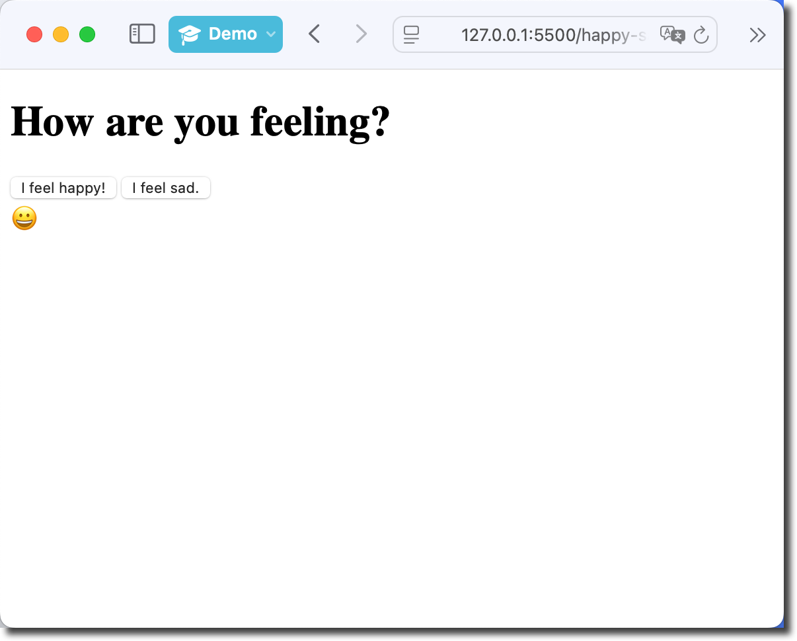
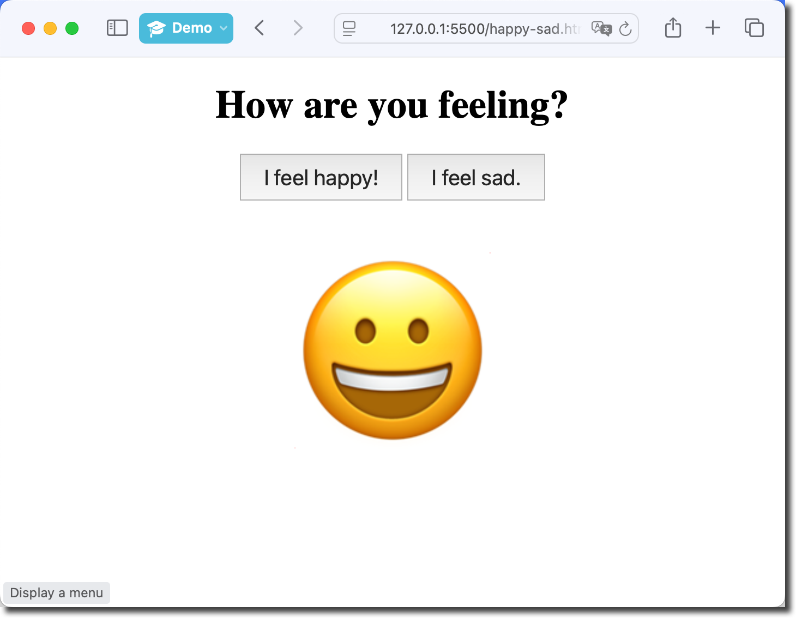

# WEB03 – Happy Or Sad

**Objectives**

Create a simple web app with buttons that display various images or emoji's.

Use JavaScript to dynamically update the web page.

**Tools Needed**

You will need a [code editor](code-editors.html) and a web browser.

## HTML Page Setup

Create a working folder named `HappyOrSad`.

Navigate to the new folder. Open the folder in your IDE if you are using one.

Create a [basic html files](web00-basic-html.html) named `happy-sad.html`

Change the **title** to show "Happy or Sad".

Change the **h1** to show "How are you feeling?".

## Button Setup

Create two HTML buttons.

<pre>
<code>
&lt;button&gt;
    I feel happy!
&lt;/button&gt;

&lt;button&gt;
    I feel sad.
&lt;/button&gt;

</code>
</pre>

## Results area setup

Create a **div** for your result with `id="mood"`.

<pre>
<code>
&lt;div id="mood"&gt;&lt;/div&gt;

</code>
</pre>

## Add **onclick** events to the buttons

We want each button to "do something" when we click on it.

We will have each button change the text content showing the proper emoji.

We will use `onclick=""` to provide the command that changes the text content of the results.

<pre>
<code>

&lt;button
    onclick="document.getElementById('mood').textContent='😀'"
&gt;
    I feel happy!
&lt;/button&gt;

&lt;button
    onclick="document.getElementById('mood').textContent='☹️'"
&gt;
    I feel sad.
&lt;/button&gt;

</code>
</pre>

Load your page in the browser and test it out. It should be basic, but functional.

## Adding some CSS

Let's add a little style to make this page more pleasing to use.

Add a style tag in the **head**.

<pre><code>
&lt;style&gt;
      body {
        margin: 0 auto;
        width: 600px;
        font-size: 18px;
        text-align: center;
      }
      button {
        font-size: 1.1em;
        padding: 10px 20px;
        margin-bottom: 25px;
        cursor: pointer;
      }
      button:hover {
        background-color: #f4f413e1;
        cursor: pointer;
      }
      #mood {
        font-size: 10em;
      }
&lt;/style&gt;
</code></pre>

## Going further

What other emotions would you add?

How would you use animated gifs or images instead of the emoji?

Which would be cuter: puppies or kittens?
