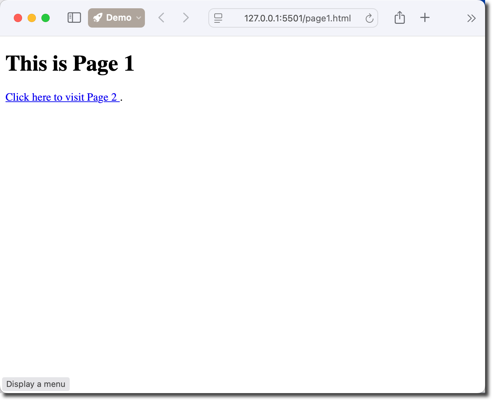
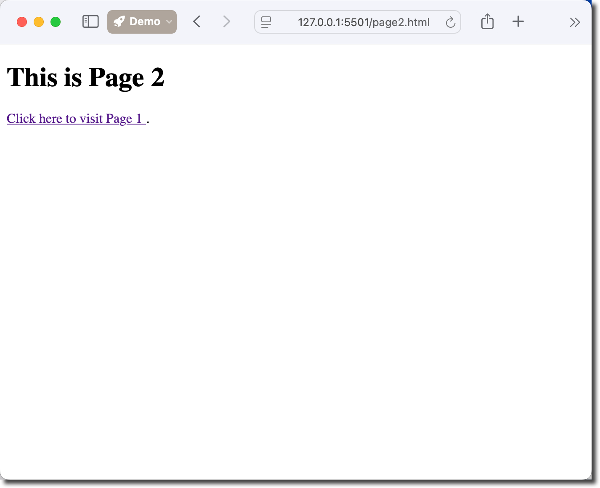

# WEB04 – Creating Links

**Objectives**

Create links between pages in a website.

**Tools Needed**

You will need a [code editor](code-editors.html) and a web browser.

## Internal vs. External Links

**Internal links** connect to pages within your own website and use relative paths like `href="about.html"` or `href="../contact.html"`. These links keep visitors on your site and load faster since they don't require connecting to external servers.

**External links** point to pages on other websites and require full URLs like `href="https://example.com"`. They take users away from your site to another domain, so it's often good practice to add `target="_blank"` to open them in a new tab, keeping your original page accessible to the visitor.

## Anchor Tags

**Anchor tags** (`<a>`) are HTML elements used to create clickable links on web pages. The `href` attribute specifies the destination.

`<a href="contact.html">Contact Us</a>` creates an internal link, while `<a href="https://mtsac.edu/cis">CIS Department</a>` links to an external site. 

You can also link to sections within the same page using `<a href="#section-id">Jump to Section</a>` where the target element has `id="section-id"`. 

Additional attributes like `target="_blank"` open links in new tabs, and `title="Description"` provide hover tooltips for better user experience.

## Step 1 – Setup 2 Basic Pages

Create two [basic html files](web00-basic-html.html).

These will be **Page 1** and **Page 2**.

Name the html files **page1.html** and **page2.html**.

Update the title to "Page 1" for page1.html and "Page 2" for page2.html.

Add an **h1** for page1.html that is "This is Page 1".

Creat a blank \*_styles.css_ file.

Your working folder should be similar to this:

<pre>
WorkingFolder
├── page1.html
├── page2.html
└── styles.css
</pre>

## Step 2 – Create Links Between the Pages

We are going to create links to move from Page 1 to Page 2 and from Page 2 back to Page 1.

Create a new paragraph and insert this code into **page1.html**.

<pre>
<code>
&lt;a href="page2.html" title="Navigate to Page 2"&gt;
Click here to visit Page 2
&lt;/a&gt;.
</code>
</pre>

Insert the following into **page2.html**.

<pre>
<code>
&lt;a href="page1.html" title="Navigate to Page 1"&gt;
Click here to visit Page 1
&lt;/a&gt;.
</code>
</pre>

Test that the links work to send you back and forth between the pages.

