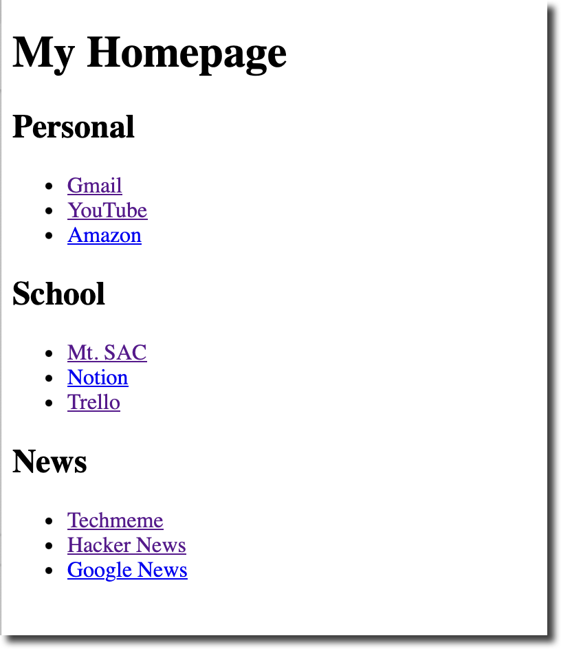
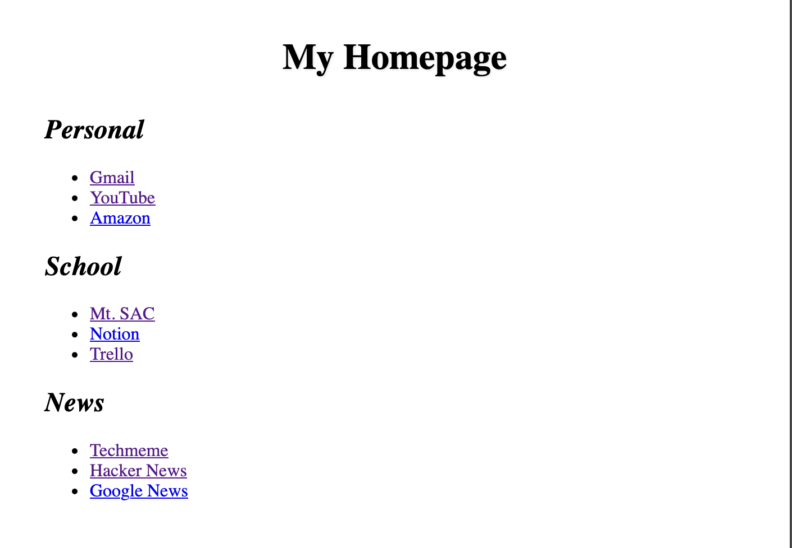
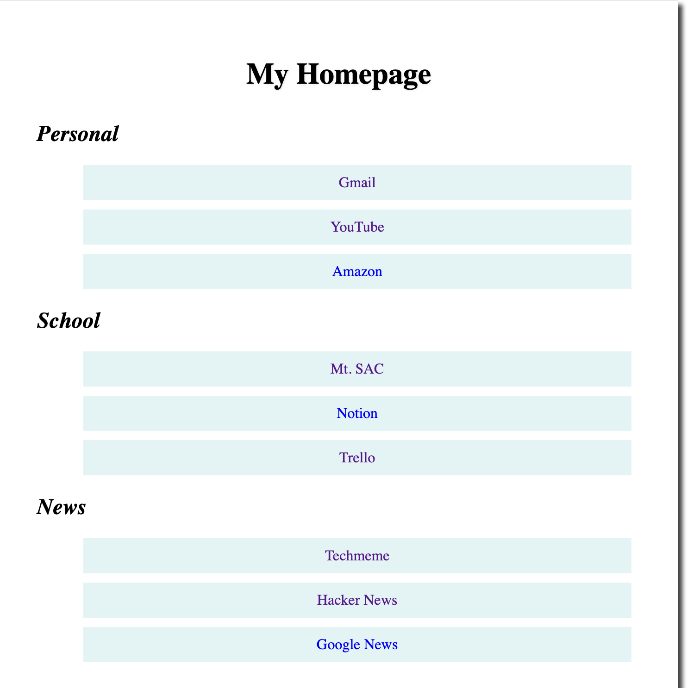

# WEB05 – Create a Custom Home Page

**Objectives**

Create a web page of useful personalized links that will open as your browser homepage.

**Tools Needed**

You will need a [code editor](code-editors.html) and a web browser.

## Why a Custom Homepage?

Setting up a custom home page can improve your productivity and browsing experience. It can be a **centralized dashboard** for your digital life. You can add your most important links, your most visited sites, sites you don't want to forget the URL to, and even link to local files on your computer.

## Project Setup

Create a working folder named **homepage**.

Create a [basic html file](web00-basic-html.html) named **homepage.html** in your working folder.

Create a blank **styles.css** file in your working folder.

Update the **title** of homepage.html to be **My Homepage**.

Update the **h1** to be **My Homepage**.

Create three **h2** elements: Personal, School, News.

## Creating a List of Links

We are going to use unordered lists (**ul**) to display our list items. Later we will use CSS to customize the look and feel of our homepage.

HTML `<ul>` (unordered list) elements create bulleted lists in web pages. Each list item is wrapped in `<li>` tags and appears with a bullet point (•) by default. For example: `<ul><li>First item</li><li>Second item</li></ul>` renders as a bulleted list. They're commonly used for navigation menus, feature lists, or any content that needs visual separation without implying order, and can be styled with CSS to change bullet appearance or layout.

Let's start with some generic personal links. You should modify these to be your own.

<pre><code>
&lt;ul&gt;
    &lt;li&gt;Gmail&lt;/li&gt;
    &lt;li&gt;YouTube&lt;/li&gt;
    &lt;li&gt;Spotify&lt;/li&gt;
    &lt;li&gt;Amazon&lt;/li&gt;
    &lt;li&gt;Discord&lt;/li&gt;
&lt;/ul&gt;
</code></pre>

## Creating  the Links

**Anchor tags** (`<a>`) are HTML elements used to create clickable links on web pages. The `href` attribute specifies the destination.

`<a href="contact.html">Contact Us</a>` creates an internal link, while `<a href="https://mtsac.edu/cis">CIS Department</a>` links to an external site. 

Additional attributes like `target="_blank"` open links in new tabs, and `title="Description"` provide hover tooltips for better user experience.

We will wrap the text inside each **li** with an anchor tag to the website that opens in a new tab.

<pre><code>
&lt;li&gt;
    &lt;a href="https://mail.google.com/mail/u/0/#inbox" target="_blank"&gt;Gmail&lt;/a&gt;
&lt;/li&gt;
</code></pre>

Do this for each of your links. Navigate to the site and copy the URL from the bar. Follow the same format for each item on your list.

**Add a list and links for the School and News categories.**

Add websites that you already know and use. Here are some suggestions:

- Mt. SAC
- Notion
- Trello
- Reddit
- GitHub
- Techmeme
- Hacker News

You will have a useful, but plain looking, homepage.

## Styling the Homepage

Open **styles.css**.

We'll set a few basic styles to make the page look decent. We will also adjust the **li** to remove the bullet points and remove the underline from the **anchor tags**

Center the webpage on the browser and center the the **h1**. We'll give it a cool text shadow. Let's make the **h2** italic as well.

<pre><code>
body {
    max-width: 800px;
    margin: 0 auto;
    padding: 40px;
}
h1 {
    font-size: 2rem;
    margin-bottom: 2rem;
    text-align: center;
    text-shadow: 1px 1px 2px rgba(0,0,0,0.1);
}
h2 {
    font-style: italic;
}
</code></pre>>

Let's make the lists and links look better. We'll make them bigger and easier to click on. We will add some space around them and give them a subtle background color.

<pre><code>
ul {
    list-style: none;
}
li {
    padding: 10px;
    margin: 10px;
    background-color:rgba(187, 225, 226, 0.404);
    text-align: center;
}
li a {
    display: block;
    text-decoration: none;
}
li a:hover {
  text-decoration: underline;
}
</code></pre>

## Make The Homepage Open in Your Browser

Move the **homepage** folder to your home directory or somewhere that your browser can access it.

Open **homepage.html** in your favorite browser and set that as the homepage to open when you open a new window.

**What about other computers?**

The custom homepage is a file on your computer. In order to use this on other computers you can put the project folder in a sync folder. Then it will update on your laptop, desktop, and other computers that you use.

**What about on my phone?**

You will need to put your page online for your phone to automatically use it. Consider hosting with github pages, amazon s3, cloudflare, etc.

### Desktop Browser Instructions

        
Click here for step-by-step instructions for Chrome.

        <ol>
            <li>
                <strong>Open the file in Chrome.</strong>
                
Find the <code>.html</code> file you just created. Right-click on it, select "Open with," and choose "Google Chrome."

            </li>
            <li>
                <strong>Copy the file path.</strong>
                
With the file open in Chrome, go to the address bar at the top and copy the entire address. It will begin with <code>file:///</code> followed by the full path to your file. For example: <code>file:///C:/Users/YourName/Documents/my_homepage.html</code>

            </li>
            <li>
                <strong>Go to Chrome's settings.</strong>
                
Click the three-dot menu icon in the top-right corner of Chrome, and then click "Settings."

            </li>
            <li>
                <strong>Navigate to startup settings.</strong>
                
In the "Settings" menu, click on "On startup" from the left-hand menu.

            </li>
            <li>
                <strong>Set a specific page.</strong>
                
Select the option that says "Open a specific page or set of pages."

            </li>
            <li>
                <strong>Add your file path.</strong>
                
Click "Add a new page," paste the file path you copied in Step 3 into the text box, and then click "Add."

            </li>
        </ol>
        
Now, when you open Chrome, it will automatically load your custom local webpage as the startup page.

    

        
Click here for step-by-step instructions for Firefox.

        <ol>
            <li>
                <strong>Open the file in Firefox.</strong>
                
Find the <code>.html</code> file you just created. Right-click on it, select "Open with," and choose "Firefox."

            </li>
            <li>
                <strong>Copy the file path.</strong>
                
With the file open in Firefox, go to the address bar at the top and copy the entire address. It will begin with <code>file:///</code> followed by the full path to your file. For example: <code>file:///C:/Users/YourName/Documents/my_homepage.html</code>

            </li>
            <li>
                <strong>Go to Firefox's settings.</strong>
                
Click the three-line "hamburger" menu icon in the top-right corner of Firefox, and then click "Settings."

            </li>
            <li>
                <strong>Navigate to the Home section.</strong>
                
In the "Settings" tab, click on "Home" from the left-hand menu.

            </li>
            <li>
                <strong>Set a custom URL.</strong>
                
Under the "New Windows and Tabs" section, find the dropdown menu next to "Homepage and new windows" and select "Custom URLs...".

            </li>
            <li>
                <strong>Paste your file path.</strong>
                
In the text box that appears, paste the file path you copied in Step 3.

            </li>
            <li>
                <strong>Save changes automatically.</strong>
                
Firefox saves your changes automatically, so you can simply close the "Settings" tab.

            </li>
        </ol>
        
Your custom local webpage will now open as the homepage whenever you launch a new Firefox window.

    

## Extra Credit

Try splitting your page into columns by adding a **main** tag around your bookmarks and defining the columns in css.

<pre><code>
main {
    column-count: 2;
    column-gap: 20px;
}
</code></pre>

