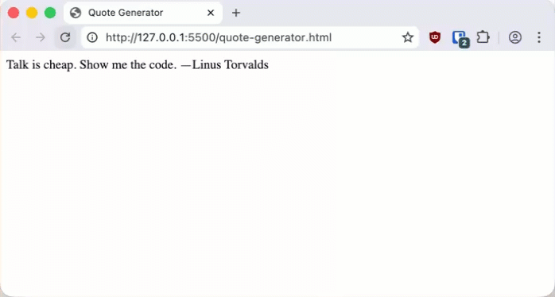
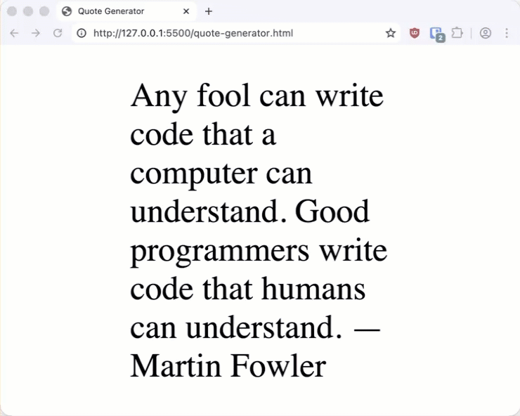

# Random Quote Generator

**Objectives**

Build a single page app that displays a random quote each time the page is loaded.

**Tools Needed**

You will need a [code editor](code-editors.html) and a web browser.

## Quote Generator

Many webpages contain dynamic content that is updated as the page is loaded in the browser. In this tutorial we will build a single-page web application that uses JavaScript to randomly select a quote to load.

## Project Setup

We will need a basic html page with two extra sections added. The `<style>` tag in the header, and a `<script>` tag at the end of the body.

Create a new file named `quote-generator.html` and type in the following code:

<pre>
<code>
&lt;!doctype html&gt;
    &lt;html lang="en-US"&gt;
    &lt;head&gt;
        &lt;meta charset="utf-8" /&gt;
        &lt;meta name="viewport" content="width=device-width" /&gt;
        &lt;title&gt;Random Quote Generator&lt;/title&gt;
        &lt;style&gt;
            &lt;!-- CSS goes here --&gt;
        &lt;/style&gt;
        
    &lt;/head&gt;
    &lt;body&gt;

        &lt;script&gt;
            // JavaScript goes here
        &lt;/script&gt;
    &lt;/body&gt;
&lt;/html&gt;
</code>
</pre>

We will need a section to target in order to add the random quote. Let's add a `<div>` with a `id="quote"` in the body and above the `<script>` tag.

Let's also add a generic quote so the page will load something if the JavaScript fails.

<pre>
<code>
&lt;div id="quote"&gt;If you can’t explain something in simple terms, you don’t really understand it. —Richard Feynman&lt;/div&gt;
</code>
</pre>

Open the page in your browser or live-server preview.

## Displaying a Random Quote

Let's start by creating our list of quotes that the JavaScript will choose from when the page is loaded.

A **constant** is a variable whose value cannot be reassigned after it is declared. We use the `const` keyword.

Enter the following code into the `<script>` tag on your page:

<pre>
<code>
const quotes = [
            "Programs must be written for people to read, and only incidentally for machines to execute. —Harold Abelson",
            "Any fool can write code that a computer can understand. Good programmers write code that humans can understand. —Martin Fowler",
            "Premature optimization is the root of all evil. —Donald Knuth"
            "Talk is cheap. Show me the code. —Linus Torvalds"
            "The best way to predict the future is to invent it. —Alan Kay"
        ]
</code>
</pre>

Your page should still show a basic webpage with the Feynman quote.

In order to display the random quote we need to:

1. Choose a random number<sup>*</sup>
2. Display the selected quote from the array

### Picking a random quote

We will use `Math.random()` to help us pick the quote. `Math.random()` returns a random number between 0 and 1, but we need a number between 0 and the length of the array.

Enter the following into your browser console:

```
> let i = Math.random()
> console.log(i)
0.6174454303286304  # Your result will be different
```

- `let i = ...` creates a variable named `i` and assigns the value generated by `Math.random()`.
- `Math.random()` generates a number between 0 and 1.
- `console.log()` outputs text to the console

We will multiply the generate number by the length of the array and then round down to make our selection.

```
> let i = Math.random() * quotes.length
> console.log(i)
3.1548306417761998  # Your result will be different
```

- `quotes.length` is a built-in property that returns the number of elements in the array
- Arrays are indexed beginning with 0

Enter this code a few times. The number should change each time.

```
> let i = Math.floor(Math.random() * quotes.length)
> console.log(i)
2  # Your result will be different
```

Now that we have the number in memory, let's get that number from the array of quotes.

Enter this code in the console and see which quote is displayed.

`console.log(quotes[i])`

- `quotes` is the variable defined in the `script` tag and contains our quotes
- `i` is the generated number
- We use `[]` to access that index of the array

Finally, let's update the quote on the webpage when it loads.

We will tell JavaScript to go to the html document, get the element named "quote, and change the text inside of it.

Enter these two lines in your script tag just below the quote array:

```
let i = Math.floor(Math.random() * quotes.length);
document.getElementById("quote").innerText = quotes[i];
```

Refresh your browser a few times. You should see the quote change. You might see the same quote twice in a row as we didn't write code to prevent that and there are only 5 quotes.

Our page is working. It loads a quote each time you refresh.



## Add some style

Let's add some simple styling to your quote page. This will make it more fun for you to show off to your friends.

Enter this into the `<style>` tag in the head:

```
#quote {
    font-size: 3rem;
    position: absolute;
    top: 50%;
    left: 50%;
    transform: translate(-50%, -50%);
}
```

The `#quote` css specifies a perfect centering on the page.

The `font-size: 3rem` sets the font size to 3 times the font size of the root (html) element.



## Taking it further

You can improve on this page in many ways. Here are some ideas

1. Select more quotes
2. Separate the quote and author in the array. Display them separately with different styling.
3. Load a new quote when a button is pushed
4. Use CSS animation when the quote is displayed
5. Call random quotes from an api such as [Zen Quotes](https://zenquotes.io/)
6. Upate the quote every minute
