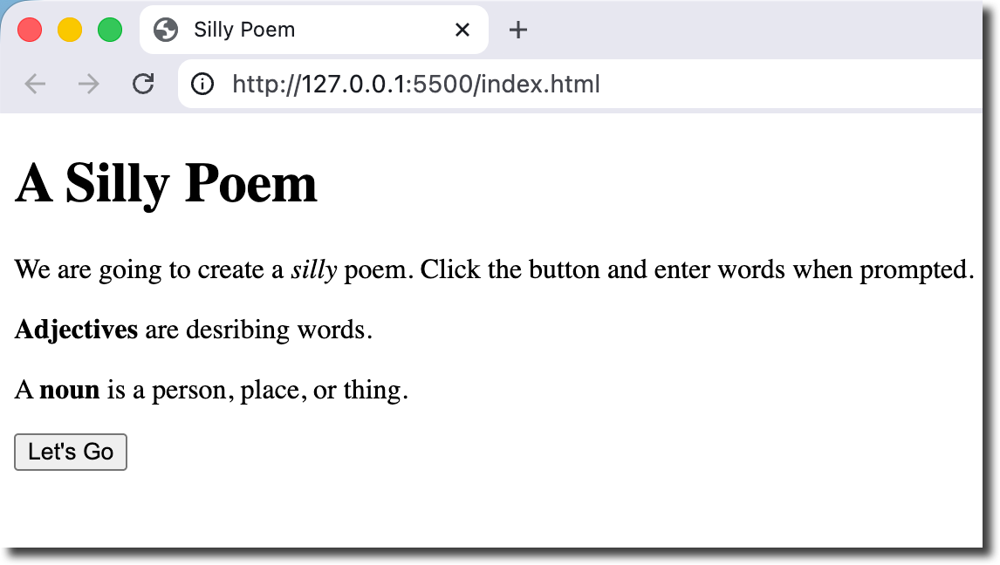
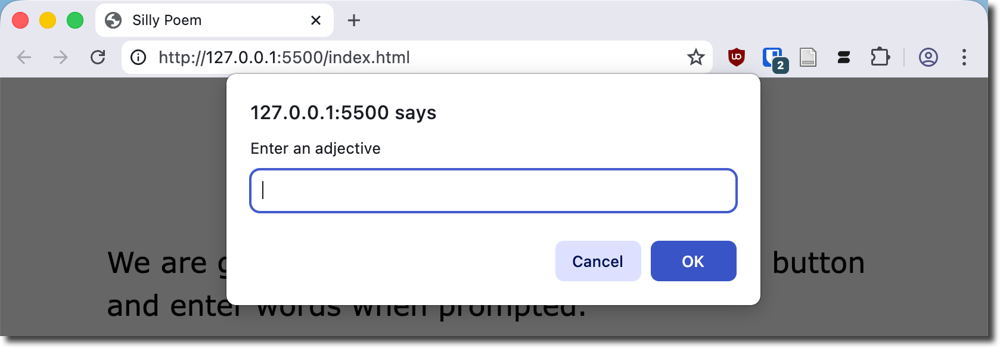
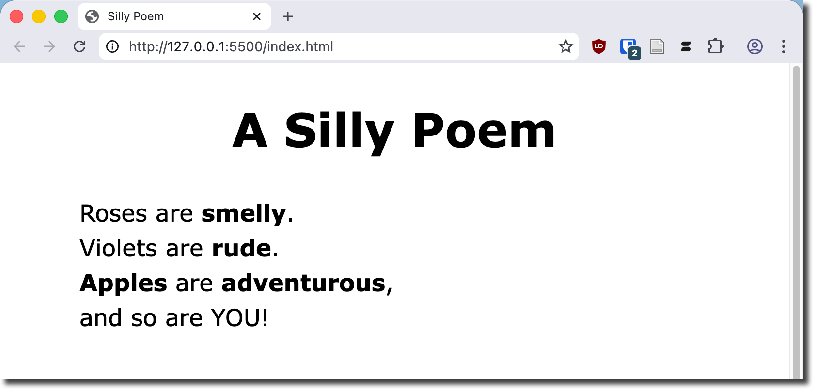

# A Silly Poem

**Objectives**

Build a single page app that gets input from the user and displays a silly poem.

**Tools Needed**

You will need a [code editor](code-editors.html) and a web browser.

## Creating a Silly Poem

This project demonstrates using `prompt()` to collect user input. It then uses **template literals** to create the poem that is displayed on the webpage.

## Project Setup

We will need a basic html page with two extra sections added. The `<style>` tag in the header, and a `<script>` tag at the end of the body.

Create a new file named `silly-poem.html` and type in the following code:

<pre>
<code>
&lt;!doctype html&gt;
    &lt;html lang="en-US"&gt;
    &lt;head&gt;
        &lt;meta charset="utf-8" /&gt;
        &lt;meta name="viewport" content="width=device-width" /&gt;
        &lt;title&gt;A Silly Poem&lt;/title&gt;
        &lt;style&gt;
            &lt;!-- CSS goes here --&gt;
        &lt;/style&gt;
        
    &lt;/head&gt;
    &lt;body&gt;
        &lt;h1&gt;A Silly Poem&lt;/h1&gt;
        
        &lt;script&gt;
            // JavaScript goes here
        &lt;/script&gt;
    &lt;/body&gt;
&lt;/html&gt;
</code>
</pre>

Let's add a **div** for the poem, a **div** for the instructions, and a button to start the javascript function.

We will give the user some instructions as well when the page loads.

<pre><code>
&lt;div id="silly-poem"&gt;&lt;/div&gt;
&lt;div id="instructions"&gt;
      &lt;p&gt;We are going to create a &lt;em&gt;silly&lt;/em&gt; poem. Click the button and enter words when prompted.&lt;/p&gt;
      
      &lt;p&gt;&lt;b&gt;Adjectives&lt;/b&gt; are desribing words.&lt;/p&gt;
      &lt;p&gt;A &lt;b&gt;noun&lt;/b&gt; is a person, place, or thing.&lt;/p&gt;
&lt;/div&gt;
&lt;button id="button"&gt;Generate Poem&lt;/button&gt;
</code></pre>

Preview your webpage. You should see a simple (and unstyled) page.

### Add style

Add the following css in the **style** tag in the head.

<pre><code>
body {
  margin: auto;
  max-width: 650px;
  font-family:Verdana, Geneva, Tahoma, sans-serif;
  font-size: 24px;
  line-height: 1.5;
}
h1,
h2 {
  text-align: center;
}
#button {
  position: relative;
  float: right;
  font-size: 1.5em;
  display: block;
  background-color: lightyellow;
}
#button:hover {
  background-color: lightskyblue;
}
#inst {
  max-width: 70%;
  margin: auto;
}
</code></pre>

Your page should look like this now:

### Adding Functionality with JavaScript

We will create a function that will be triggered when the button is clicked. The function will:

- Get user input for the words
- Hide the instructions div
- Hide the button
- Insert the generated HTML in the silly-poem div
- Display the silly-poem div

<pre>
                                    ┌──────────────────┐
                                    │  createPoem()    │
                                    └──────────────────┘
                                              │
        ┌─────────────────────────────────────┼─────────────────┐
        ▼                                     ▼                 ▼
┌─────────────────┐                  ┌──────────────┐  ┌────────────────┐
│ Hide            │                  │  Get User    │  │ Hide Button    │
│ #instructions   │                  │   Inputs     │  │                │
│ (set visibility)│                  │  (4 prompts) │  │ (set visibility│
└─────────────────┘                  └──────────────┘  └────────────────┘
                                              │
                                              │
                                              ▼
                                      ┌────────────────────┐
                                      │ Build Message      │
                                      │ (template string)  │
                                      └────────────────────┘
                                                 │
                                                 ▼
                                      ┌────────────────────┐
                                      │ Display in         │
                                      │ #silly-poem        │
                                      │ (innerHTML)        │
                                      └────────────────────┘
</pre>

**Define the variables**

We are going to build the JavaScript inside of the `<script>` tag at the bottom of the page.

Let's start by defining the variables needed: sillyPoem, instructions, and button.

Then we will create a function named createPoem() that will prompt the user for 3 adjectives and a plural noun. The function will use **template literals** to substitute the text inline.

Finally, we will add an event listener to the button that calls the function when clicked.

What is a template literal?

A <b>template literal</b> (sometimes called a template string) is a special kind of string literal in JavaScript that lets you:

<ol>
	<li>Embed variables and expressions directly inside a string</li>
	<li>Use multi-line strings easily</li>
	<li>Create flexible, readable templates for building dynamic text<li>
</ol>

They’re enclosed by backticks (`) instead of single (') or double (") quotes.

Enter the following JavaScript in the `<script>` tag:

<pre><code>
// define variables
const sillyPoem = document.getElementById('silly-poem');
const instructions = document.getElementById('instructions');
const button = document.getElementById('button');

// create a function for our silly poem
function createPoem() {
    // hide the instructions
    instructions.style.visibility = 'hidden';

    // get the user input
    const adj1 = prompt('Enter an adjective');
    const adj2 = prompt('Enter another adjective');
    const noun = prompt('Enter a PLURAL noun');
    const adj3 = prompt('Enter one more adjective');

    // create the silly poem
    let message = `&lt;p&gt;Roses are &lt;b&gt;${adj1}&lt;/b&gt;.&lt;br&gt;`;
    message += `Violets are &lt;b&gt;${adj2}&lt;/b&gt;.&lt;br&gt;`;
    message += `&lt;b&gt;${noun}&lt;/b&gt; are &lt;b&gt;${adj3}&lt;/b&gt;,&lt;br&gt;`;
    message += `and so are YOU!&lt;/p&gt;`;
    
    // display the silly poem
    sillyPoem.innerHTML = message;

    button.style.visibility = 'hidden';
}

// add an event listener to the button
button.addEventListener('click', createPoem);
</code></pre>

### Test your code

Click the button and start entering your silly words when prompted.

Your poem will display after you enter all the words.

## Going Further

Try to test that the user actually entered something and give them a polite reminder message.

You might annoy your users if you give them too many pop-ups. Try using an html form to collect the user information?

Try out different poems that are selected at random when you press the button.

Add web fonts and simple animations to make the page feel a little more fun.