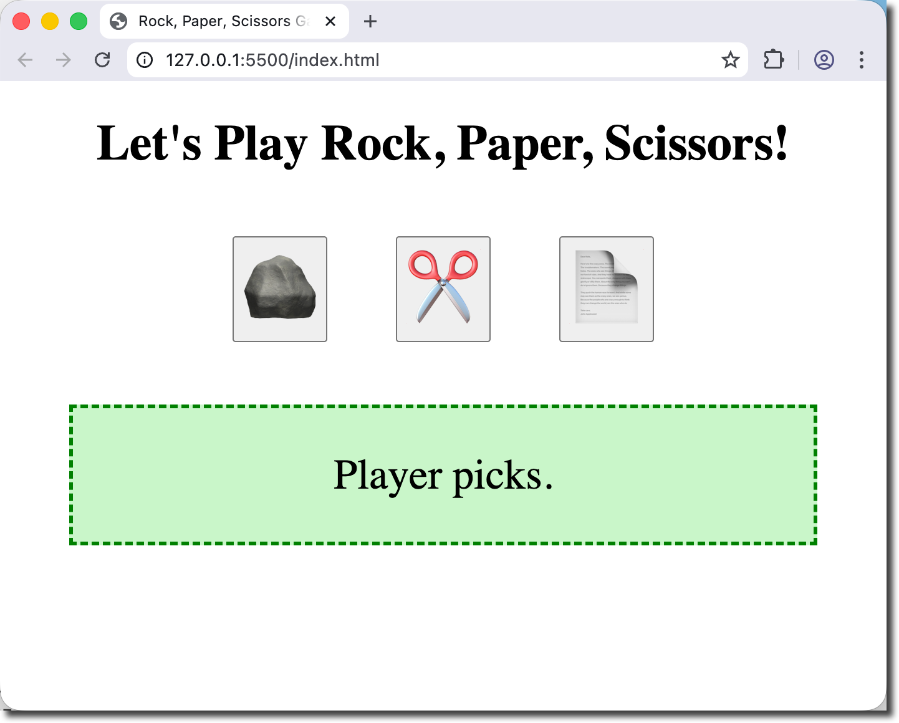
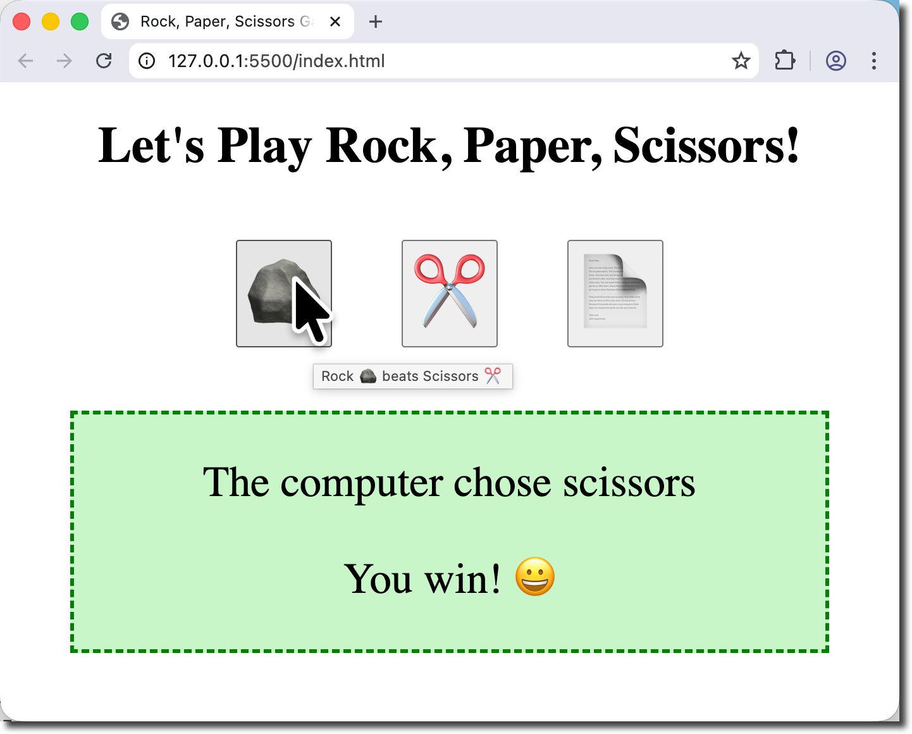
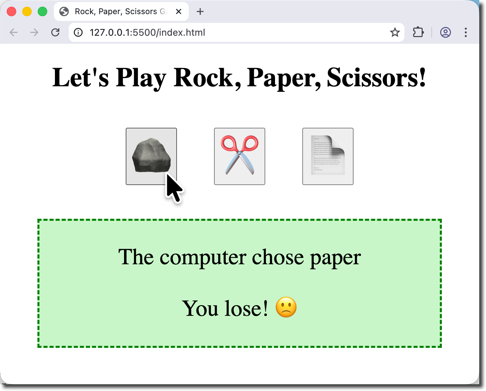
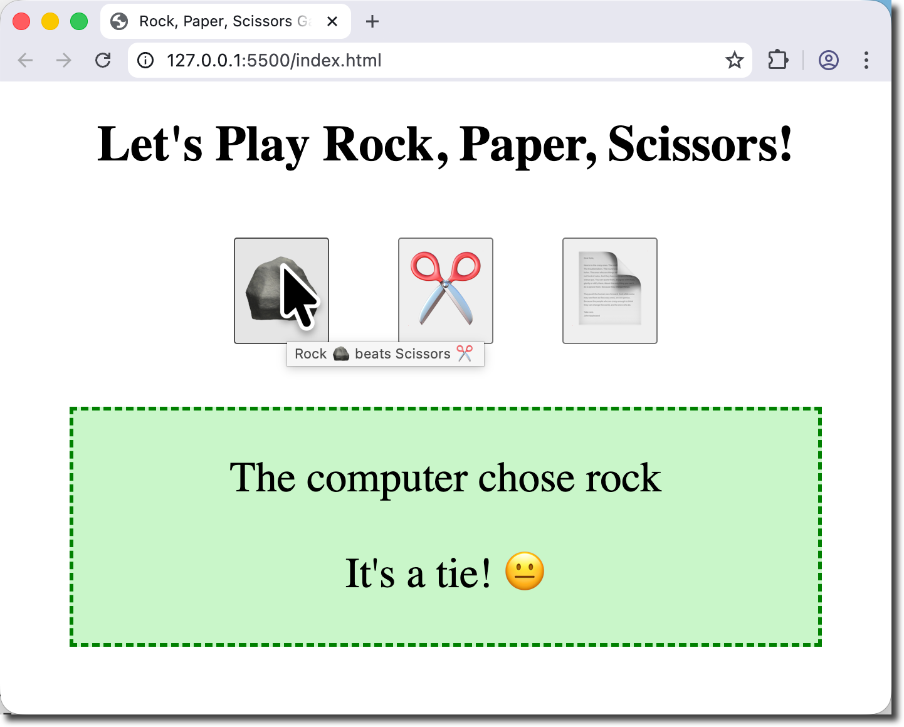

# Let's Play Rock, Paper, Scissors!

**Objectives**

Build a web application to play Rock, Paper, Scissors.

**Tools Needed**

You will need a [code editor](code-editors.html) and a web browser.

## Playing Rock, Paper, Scissors

This project will use a simple webpage to demonstrate conditional logic flow in JavaScript. The player will click on a button that triggers the JavaScript function `playRPS` and sends the player choice.

## HTML Setup

We will need a basic html page with links to **script.js** and **style.css**.

Create a new file named `play-rps.html` and type in the following code:

<pre>
<code>
&lt;!doctype html&gt;
    &lt;html lang="en-US"&gt;
    &lt;head&gt;
        &lt;meta charset="utf-8"&gt;
        &lt;meta name="viewport" content="width=device-width"&gt;
        &lt;title&gt;Rock, Paper, Scissors Game&lt;/title&gt;
        &lt;link rel="stylesheet" href="style.css"&gt;
        &lt;script src="script.js" defer &gt;&lt;/script&gt;
    &lt;/head&gt;
    &lt;body&gt;
        &lt;h1&gt;Let's Play Rock, Paper, Scissors!&lt;/h1&gt;
        
    &lt;/body&gt;
&lt;/html&gt;
</code>
</pre>

**Adding divs**

We will need space on the page for the buttons and for the results. Let's create two **divs** below the **h1** in the body.

<pre>
<code>
&lt;div&gt;
    &lt;-- We'll add buttons here --&gt;
&lt;/div&gt;
&lt;div id="results"&gt;
    &lt;p&gt;Player picks.&lt;/p&gt;
&lt;/div&gt;
</code>
</pre>

What is an HTML button?

An HTML button is an interactive element that users can click to trigger an action. Here's the breakdown:

Basic syntax:

<pre>
<code>
&lt;button&gt;Click me&lt;/button&gt;
</code>
</pre>
<table style="border-collapse: collapse; width: 100%;">
  <tr>
    <th style="border: 1px solid #ccc; padding: 10px;">Attribute</th>
    <th style="border: 1px solid #ccc; padding: 10px;">Purpose</th>
    <th style="border: 1px solid #ccc; padding: 10px;">Example</th>
  </tr>
  <tr>
    <td style="border: 1px solid #ccc; padding: 10px;">type</td>
    <td style="border: 1px solid #ccc; padding: 10px;">Specifies button behavior</td>
    <td style="border: 1px solid #ccc; padding: 10px;">type="button"</td>
  </tr>
  <tr>
    <td style="border: 1px solid #ccc; padding: 10px;">id</td>
    <td style="border: 1px solid #ccc; padding: 10px;">Unique identifier for styling/JavaScript</td>
    <td style="border: 1px solid #ccc; padding: 10px;">id="myButton"</td>
  </tr>
  <tr>
    <td style="border: 1px solid #ccc; padding: 10px;">class</td>
    <td style="border: 1px solid #ccc; padding: 10px;">CSS class for styling</td>
    <td style="border: 1px solid #ccc; padding: 10px;">class="primary-btn"</td>
  </tr>
  <tr>
    <td style="border: 1px solid #ccc; padding: 10px;">disabled</td>
    <td style="border: 1px solid #ccc; padding: 10px;">Disables the button</td>
    <td style="border: 1px solid #ccc; padding: 10px;">disabled</td>
  </tr>
  <tr>
    <td style="border: 1px solid #ccc; padding: 10px;">onclick</td>
    <td style="border: 1px solid #ccc; padding: 10px;">Runs JavaScript when clicked</td>
    <td style="border: 1px solid #ccc; padding: 10px;">onclick="doSomething()"</td>
  </tr>
</table>

**Add the buttons**

We will present the player with a button for each choice (r, p, s). Clicking the button will trigger our JavaScript with the `onclick` attribute.

Each button will use the **title** attribute to display it's rule. We will add a class of **game-btn** to style the buttons with css. We will set **onclick** to call the `playRPS()` function with the players choice of r, p, or s. 

Add the buttons to the empty div in the body.

<pre>
<code>
&lt;button class="game-btn" 
    title="Rock 🪨 beats Scissors ✂️" 
    onclick="playRPS('r')"&gt;
    🪨
&lt;/button&gt;

&lt;button class="game-btn" 
    title="Scissors ✂️ beat Paper 📄" 
    onclick="playRPS('s')"&gt;
    ✂️
&lt;/button&gt;

&lt;button class="game-btn" 
    title="Paper 📄 beats Rock 🪨" 
    onclick="playRPS('p')"&gt;
    📄
&lt;/button&gt;
</code>
</pre>

How do I type emoji's into the HTML?

You can use keyboard shortcuts to open the emoji picker for your operating system, or copy and paste them from this page.

<table style="border-collapse: collapse; width: 100%;">
<tr>
    <td style="border: 1px solid #ccc; padding: 10px;">macOS</td>
    <td style="border: 1px solid #ccc; padding: 10px;">ctrl+cmd+space</td>
</tr>
<tr>
    <td style="border: 1px solid #ccc; padding: 10px;">Windows</td>
    <td style="border: 1px solid #ccc; padding: 10px;">windows key + .</td>
</tr>
</table>

The basic application should be ready to go. Let's write the code for the game next.

## JavaScript Setup

The **script.js** file will contain our code. It is loaded after the html page loads (because of the defer tag) and is ready for us to call it.

This is the flow of our program.

<pre>
┌─────────────────────────────────────┐
│   Player Clicks a Button            │
│   (Rock / Paper / Scissors)         │
└────────────┬────────────────────────┘
             │
             ▼
┌─────────────────────────────────────┐
│  Computer Randomly Picks            │
│  Rock / Paper / Scissors            │
└────────────┬────────────────────────┘
             │
             ▼
┌─────────────────────────────────────┐
│  Compare Choices                    │
└────────────┬────────────────────────┘
             │
        ┌────┴────┬────────────┐
        │         │            │
        ▼         ▼            ▼
    ┌──────┐  ┌──────┐      ┌──────┐
    │ WIN  │  │ LOSE │      │ TIE  │
    └──────┘  └──────┘      └──────┘
        │          │           │
        └────┬─────┴─────┬─────┘
             │           │
             ▼           ▼
    ┌─────────────────────────────────┐
    │  Display Result on Screen:      │
    │  • Computer's choice            │
    │  • Win/Lose/Tie message         │
    │  • Emoji feedback 😀 😐 🙁       │
    └─────────────────────────────────┘
</pre>

Open your **script.js** file and enter the following:

<pre>
<code>
// rock, paper, scissors
// The button sends r, p, or s to the function to calculate results

let computer_choice = '';
let choices = ['r','p','s'];
let choices_long = ['rock', 'paper', 'scissors'];
let results = document.getElementById('results');
</code>
</pre>

We are defining the following variables for this project:

* **computer_choice** will be randomly selected each time the function is called
* **choices** is a list of possible choices
* **choices_long** is the choices written out
* **results** is the results div in the html file

Next we will create the **function** to be called:

<pre>
<code>
function playRPS(player_choice) {
    // code will go here
}
</code>
</pre>

The following code will be typed **INSIDE** the function (between the curly braces {}).

This will be called whenever a button is selected. The **onclick** event will send the player_choice (r, p, or s) to the function.

The computer will generate a random choice and assign that choice to the **computer_choice** variable.

Note that we are rounding down as we are using this to select an item from the **choices** array.

<pre><code>
// generate a random computer_choice
let x = Math.floor(Math.random() * 3)
computer_choice = choices[x];
</code>
</pre>

We will add the computers choice to the results message using a template literal (notice the backtick).

<pre>
<code>
// Add the computer choice to the results message
message = `&lt;p&gt;The computer chose ${choices_long[x]}&lt;/p&gt;`;
</code>
</pre>

Determine the outcome by comparing the **player_choice** and **computer_choice**. First check for the player to win, then for a tie, and finally for the computer to win.

We are checking for the player win like this:

* IF the player chose 'r' AND the computer chose 's'
* OR the player chose 'p' AND the computer chose 'r'
* OR the player chose 's' AND the computer chose 'p'

Then update the message with "You win! 😀"

Next we check (**else if**) whether the player and computer chose the same thing.

If neither of those is true, then the computer must have won.

We will style the output with **class="result"**.

<pre>
<code>
// check if player wins, then check for a tie, otherwise comp wins
if ( player_choice == 'r' && computer_choice == 's' ||
     player_choice == 'p' && computer_choice == 'r' ||
     player_choice == 's' && computer_choice == 'p' ) {
        message += '&lt;p class="result"&gt;You win! 😀&lt;/p&gt;';
    } else if (player_choice == computer_choice) {
        message += '&lt;p class="result"&gt;It\'s a tie! 😐&lt;/p&gt;';
    } else {
        message += '&lt;p class="result"&gt;You lose! 🙁&lt;/p&gt;';
    }
</code>
</pre>

The last step of the function is to replace the html inside the results div.

<pre>
<code>
results.innerHTML = message;
</code>
</pre>

Show entire script.js code.

<pre>
<code>
// rock, paper, scissors
// The button sends r, p, or s to the function to calculate results

let computer_choice = '';
let choices = ['r','p','s'];
let choices_long = ['rock', 'paper', 'scissors'];
let results = document.getElementById('results');

function playRPS(player_choice) {
    // generate a random computer_choice
    let x = Math.floor(Math.random() * 3)
    computer_choice = choices[x];

    // Add the computer choice to the results message
    message = `&lt;p&gt;The computer chose ${choices_long[x]}&lt;/p&gt;`;

    // check if player wins, then check for a tie, otherwise comp wins
    if ( player_choice == 'r' && computer_choice == 's' ||
        player_choice == 'p' && computer_choice == 'r' ||
        player_choice == 's' && computer_choice == 'p' ) {
            message += '&lt;p class="result"&gt;You win! 😀&lt;/p&gt;';
        } else if (player_choice == computer_choice) {
            message += '&lt;p class="result"&gt;It\'s a tie! 😐&lt;/p&gt;';
        } else {
            message += '&lt;p class="result"&gt;You lose! 🙁&lt;/p&gt;';
        }
    
    results.innerHTML = message;
}
</code>
</pre>

Test your page several times by clicking the buttons. Make sure that each button can generate a win, lose or tie.

## Styling the Page

Let's make our page a little more fun to play.

Enter the following CSS into the **style.css** file:

<pre>
<code>
body {
    width: 600px;
    margin: auto;
    font-size: 20px;
    text-align: center;
}
.game-btn {
    font-size: 3em;
    margin: 25px 25px 50px 25px;
}
#results {
    font-size: 1.7em;
    background-color: rgba(144, 238, 144, 0.5);
    border: 3px dashed green;
}

</code>
</pre>

* **body**: We make the page 600px wide with a large font and center
* **.game-btn**: makes each button 3em large and sets a spacious margin
* **#results**: The results div has large font, a light green background, and a dashed green border.

🎉 Congratulations! 🎉

Have fun playing your game and sharing with your friends!

## Going Further

How would you customize your game further? What would make this a better playing experience?

Here are some ideas to try:

* Use a different background color for losses (e.g. red) and ties (e.g. yellow)
* Keep track of how many times the player has played since the page was refreshed
* Track win statistics
* Add animations to the results
* Show css confetti when the player wins, or after a certain win streak (e.g. 5 wins in a row)
* Add some fun easter eggs such as if you pick 5 rocks in a row, display the "blockhead" achievement, etc.

<a href="#top">Back to top.</a>

