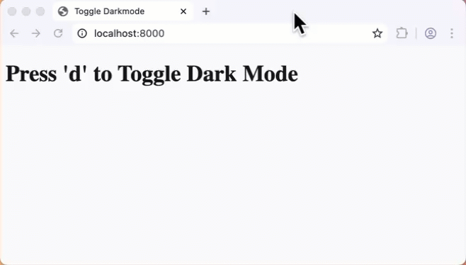

# Press 'd' to Toggle Dark Mode

**Objectives**

Toggle a **darkmode** class when the 'd' key is pressed.

**Tools Needed**

You will need a [code editor](code-editors.html) and a web browser.

## Why Darkmode?

A light-on-dark color scheme uses light-colored text, icons, and elements on a dark background. Some people prefer dark mode and claim it reduces eye strain. Some people just think it's cool.

## Listening for Keystrokes

Events happen on a webpage. Our code can respond to them. For this project we will use the **keydown** event to switch the body class to dark mode when the 'd' key is pressed.

## HTML Setup

Create a working folder for this project named **darkmode**.

Create a basic html page with **script.js** and **style.css**.

Create a new file named `darkmode.html`.

<pre>
<code>
&lt;!doctype html&gt;
    &lt;html lang="en-US"&gt;
    &lt;head&gt;
        &lt;meta charset="utf-8"&gt;
        &lt;meta name="viewport" content="width=device-width"&gt;
        &lt;title&gt;Toggle Dark Mode&lt;/title&gt;
        &lt;link rel="stylesheet" href="style.css"&gt;
        &lt;script src="script.js" defer &gt;&lt;/script&gt;
    &lt;/head&gt;
    &lt;body&gt;
        &lt;h1&gt;Press 'd' to Toggle Dark Mode&lt;/h1&gt;
        
    &lt;/body&gt;
&lt;/html&gt;
</code>
</pre>

### Add CSS

We will define both a light and dark color. Then specify those for the body and the darkmode class. We will put variables in the root.

<pre><code>
:root {
    --dark-color: rgb(22, 22, 22);
    --light-color: rgb(249, 249, 249);
  }
body {
    background-color: var(--light-color);
    color: var(--dark-color);
}
.darkmode {
    background-color: var(--dark-color);
    color: var(--light-color);
}
</code></pre>

The page will load with the specified light-color background and dark color font by default.

### JS

We are going to create a function named **toggleDarkMode()** that will listen for the **keydown** event and trigger the function.

Create the function:

<pre><code>
function toggleDarkMode(event) {
    // the e.keyCode for 'd' is 68
    if ( event.keyCode == 68 ) {
        document.body.classList.toggle('darkmode');
    }
}
</code></pre>

Notice that we are checking for a specific keyCode: 68. The function will do nothing for other keys.

Add an event listener to the entire document.

<pre><code>
document.addEventListener("keydown", toggleDarkMode);
</code></pre>

Open in live-server and test your code.

<video
  src="../imgs/web12-toggle.mp4"
  controls
  playsinline
  preload="metadata"
  width=400px>
  
</video>

## Going Further

- What more can you do with keyboard interaction?
- How can you change the dark and light colors to something different?
- What if you wanted to press a button in addition to the keydown?
- Could you add different features for different keystrokes? Such as blanking the screen?
- What about having a secret code that opens a hidding link?
- the prefers-color-scheme media query to switch to darkmode if the user prefers it

<a href="#top">Back to top.</a>
