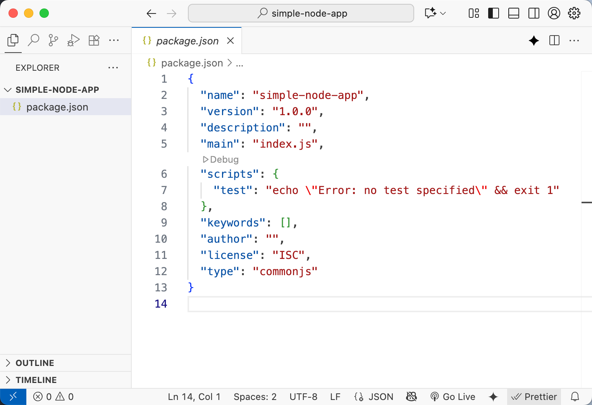
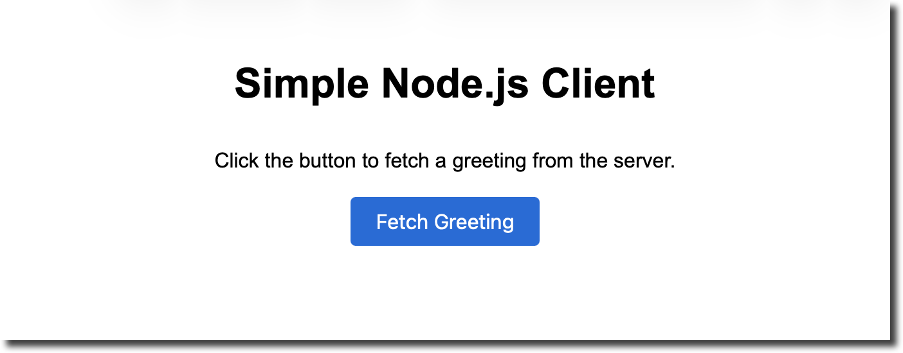
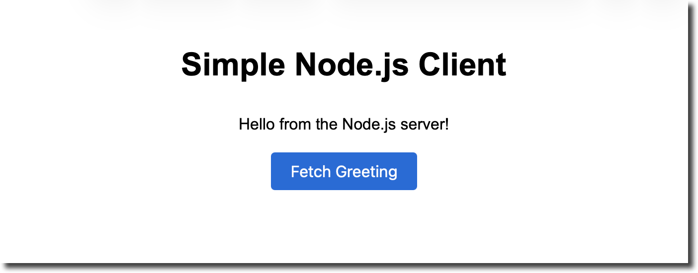
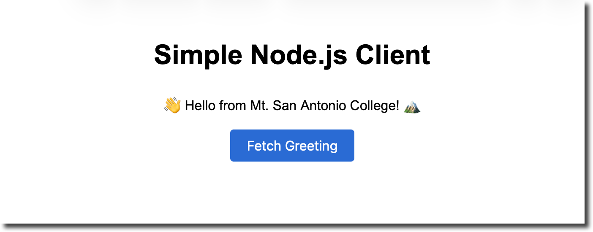
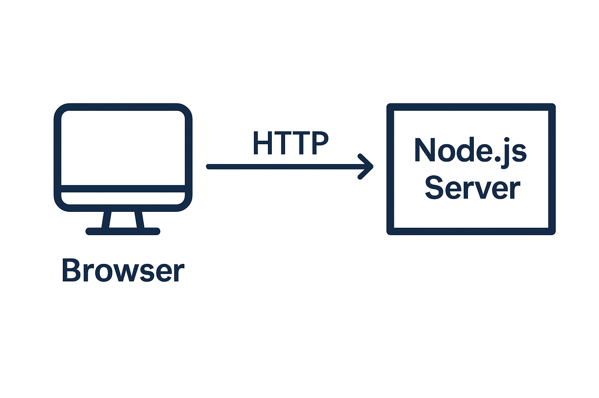

# WEB17 – Simple Node.js Application & Website

## Objectives

This tutorial walks through building a very simple **Node.js** application and connecting a basic web page to it.  Along the way you will learn what Node.js and Express are, why a `package.json` file is important and how to use the modern **Fetch API** to communicate between your front end and back end.  The tutorial assumes that you already know basic HTML and CSS.

**Tools Needed**

- You will need a [code editor](code-editors.html)
- A recent installation of [**Node.js**](https://nodejs.org/en/download/) and the **npm** package manager (these are installed together).  
- A modern web browser (Chrome, Firefox, etc.).

## What is Node.js?

Node.js is an *asynchronous event‑driven JavaScript runtime* built on Chrome’s **V8** engine.  It was designed to build scalable network applications. 

Because Node is not tied to a browser environment, it exposes system‑level APIs such as file access and network sockets.  When combined with the **npm** package manager and web frameworks like **Express**, Node becomes a powerful platform for building back‑end services that speak HTTP.

## What is `package.json`?

Node uses a plain‑text file called **package.json** to manage dependencies and describe your project.  The file lists the package’s name, version, description, entry point, dependencies and development dependencies, the versions of Node it can work with and other metadata.  When you install packages with npm they are added to the appropriate section of `package.json`; later, npm can reinstall every dependency automatically.  In other words, `package.json` tells npm everything it needs to fetch and run your application.

## What is Express?

**Express** is a small web framework built on top of Node’s HTTP server.  It simplifies tasks such as routing (mapping URLs to functions) and handling responses.  A minimal Express application is just a few lines long: you create an `app`, specify handlers with `app.get()` and start listening on a port.  The official documentation’s “Hello world” example shows how the app listens on port 3000 and responds with “Hello World!” for requests to the root URL.  We will use Express in this tutorial to avoid having to write raw HTTP server code.

## Step 1 – Set up the project

1. **Create a working folder.** Open your terminal, navigate to a convenient location (e.g. your Desktop) and create a new directory named **simple‑node‑app**:

   ```bash
   mkdir simple-node-app
   cd simple-node-app
   ```

   This folder will contain both your Node.js server and the web page.

2. **Initialize a `package.json` file.** Inside the `simple-node-app` folder run:

   ```bash
   npm init -y
   ```

   The `npm init` command generates a `package.json` file and prompts you for the package’s name, version and entry file.  Using the `-y` flag accepts the defaults so you don’t have to answer each question.  The resulting file contains fields like `name`, `version` and `main`.  Later, when you install Express, npm will automatically add it to the `dependencies` section.





3. **Install Express.** Still in the project directory, install Express as a dependency:

   ```bash
   npm install express
   ```

   npm will download Express into a `node_modules` folder and write an entry in the `dependencies` section of your `package.json`.  Installing Express here keeps your server dependencies separated from system‑wide modules.

## Step 2 – Build the Node.js server

1. **Create a server file.** In the root of `simple-node-app`, create a new file named **server.js**.  Open it in your editor and add the following code:

   ```js
   const express = require('express');
   const app = express();
   const port = 3000;

   // Serve static files from the "public" directory
   app.use(express.static('public'));

   // API route that returns a JSON greeting
   app.get('/api/greet', (req, res) => {
     res.json({ message: 'Hello from the Node.js server!' });
   });

   // Start the server
   app.listen(port, () => {
     console.log(`Server running at http://localhost:${port}/`);
   });
   ```

   - `require('express')` imports the Express module.  In Node you use `require()` to load external modules; this is part of the CommonJS module system.  
   - `app.use(express.static('public'))` tells Express to serve files from a folder named `public` relative to your project’s root.  This will be used for the HTML page later.  
   - `app.get('/api/greet', ...)` defines a **route** that responds to HTTP GET requests made to `/api/greet`.  When the server receives a request for this URL it calls the provided function and sends a JSON response.  The `res.json()` method sets the correct headers and converts the JavaScript object into JSON.  
   - `app.listen(port, ...)` starts the server and instructs it to listen on the given port.  The Express “Hello World” example explains that the app listens on a port and responds to requests by executing your callback.

2. **Start the server.** Save the file and run the following command in your terminal:

   ```bash
   node server.js
   ```

   If everything is configured correctly you should see a message like:

   ```text
   Server running at http://localhost:3000/
   ```

   The server will continue running in your terminal until you stop it (use `Ctrl+C` to exit).  Opening `http://localhost:3000/api/greet` in a browser should display a JSON response: `{"message":"Hello from the Node.js server!"}`.  For now there isn’t an HTML page yet because we haven’t created it.

## Step 3 – Create a simple web page

The web page will live in a folder named **public** (the same folder we configured Express to serve).  Express automatically makes files in this directory accessible via `http://localhost:3000/<filename>`.

1. **Create the public folder and files.** Inside your project directory run:

   ```bash
   mkdir public
   touch public/index.html
   touch public/style.css
   ```

2. **Edit `public/index.html`.** Open the file and add the following HTML:

   ```html
   <!DOCTYPE html>
   <html lang="en">
   <head>
     <meta charset="UTF-8">
     <meta name="viewport" content="width=device-width, initial-scale=1.0">
     <title>Simple Node.js Client</title>
     <link rel="stylesheet" href="style.css">
   </head>
   <body>
     <h1>Simple Node.js Client</h1>
     <p id="response-text">Click the button to fetch a greeting from the server.</p>
     <button id="fetch-btn">Fetch Greeting</button>

     <script>
       const button = document.getElementById('fetch-btn');
       const responseText = document.getElementById('response-text');
       button.addEventListener('click', async () => {
         try {
           // Use the Fetch API to request data from the Node server
           const response = await fetch('/api/greet');
           if (!response.ok) {
             throw new Error(`Server error: ${response.status}`);
           }
           const data = await response.json();
           responseText.textContent = data.message;
         } catch (err) {
           responseText.textContent = err.message;
         }
       });
     </script>
   </body>
   </html>
   ```

   - The `<link>` tag includes a separate `style.css` file for styling.  
   - A `<button>` is provided so users can decide when to fetch the data.  
   - Inside the `<script>` tag we use the **Fetch API**.  MDN describes fetch as a modern replacement for `XMLHttpRequest`; it is a promise‑based global function that makes HTTP requests and returns a **Response** object [oai_citation:9‡developer.mozilla.org](https://developer.mozilla.org/en-US/docs/Web/API/Fetch_API/Using_Fetch#:~:text=Using%20the%20Fetch%20API).  We call `fetch('/api/greet')` and await the response.  If the request is successful we call `response.json()` to parse the JSON body; otherwise we throw an error.  The result is displayed inside the `<p>` element.

3. **Add basic styling.** Edit `public/style.css` with some simple CSS to center the page and style the button:

   ```css
   body {
     font-family: Arial, sans-serif;
     max-width: 600px;
     margin: 40px auto;
     text-align: center;
     padding: 0 20px;
     line-height: 1.6;
   }

   button {
     padding: 10px 20px;
     font-size: 16px;
     cursor: pointer;
     background-color: #2a6bd4;
     color: #fff;
     border: none;
     border-radius: 4px;
   }

   button:hover {
     background-color: #184a8c;
   }
   ```

   Feel free to customise the colours and fonts to your liking.  The CSS above centres the content and gives the button a pleasant appearance.

## Step 4 – Run and test everything

1. **Start the server** (if it isn’t already running) with `node server.js`.

2. **Open the web page.** In your browser navigate to `http://localhost:3000/`.  Because Express serves static files from the `public` folder, the `index.html` file will load automatically.  You should see the page title and a button.  When you click the button, the browser will call the `/api/greet` route, receive a JSON response and update the paragraph text.

   The Fetch API call returns a **Promise** that resolves with a `Response` object; we then parse the response body with `response.json()` and update the DOM.  MDN notes that `fetch()` returns a promise that can be fulfilled with a Response representing the server’s response [oai_citation:10‡developer.mozilla.org](https://developer.mozilla.org/en-US/docs/Web/API/Fetch_API/Using_Fetch#:~:text=Using%20the%20Fetch%20API).





3. **Experiment.** Try changing the message in your server’s `/api/greet` route and refresh the web page.  The client automatically pulls in the new message when you click the button.  You can add additional routes (e.g. `/api/time` that returns the current date) and fetch them using different buttons.



## Step 5 – Understanding the architecture

Node.js enables you to run JavaScript on the server side, while the browser still executes JavaScript on the client side.  The two environments communicate over **HTTP**.  The diagram below summarises the relationship:



1. The **browser** requests a page from the Node.js server.  Express serves static files like `index.html` and `style.css`.  
2. When the user clicks the button, the browser sends an **HTTP GET** request to `/api/greet` using the Fetch API.  
3. The Node.js server processes the request and sends a **JSON** response.  
4. The browser parses the response and updates the DOM.

Understanding this flow will help you build more complex applications.  Node.js handles I/O asynchronously and does not block the event loop, so the server remains responsive even when handling multiple simultaneous requests.

## Next Steps

- **Add more routes**: Create new endpoints that return data such as the current date/time or random numbers.  You can even serve HTML fragments and insert them into the page.  
- **Use POST requests**: Modify the client to send JSON data to the server using `fetch('/api/echo', { method: 'POST', body: JSON.stringify({ message: 'Hello' }), headers: { 'Content-Type': 'application/json' }})` and handle it in your server with `app.post()`.  
- **Persist data**: Explore databases like SQLite or MongoDB to store information rather than keeping everything in memory.  
- **Learn about CORS**: If you serve your client from a different domain or port than your server, browsers enforce cross‑origin resource sharing policies.  Express provides the `cors` package to enable requests from different origins.

This simple project demonstrates the fundamentals of building a Node.js back end and connecting it to a front‑end web page.  From here you can explore more features of Express, add middleware for authentication, integrate a templating engine (like Pug or EJS), or build a single‑page application with a framework like React or Vue.