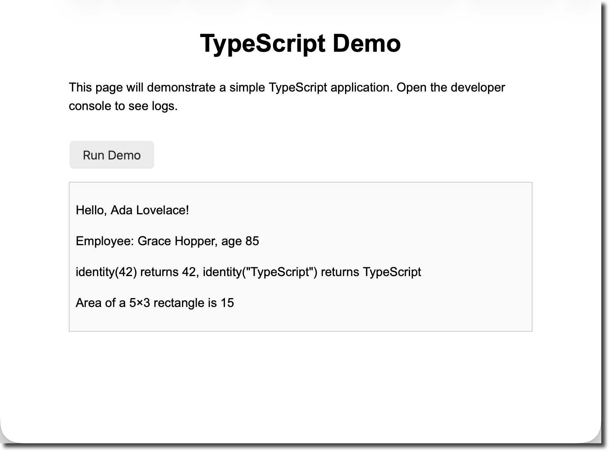

# WEB18 – Simple TypeScript Application

**Objectives**

In this demo you will build a small web project using **TypeScript**.  Along the way you will learn why developers increasingly choose TypeScript over JavaScript.  By the end you will be able to:

- Explain what TypeScript is and why it was created.
- Set up a local TypeScript environment and compile `.ts` files to JavaScript.
- Write a simple application that uses variables, functions, interfaces, classes and generics.
- See how the TypeScript compiler catches common mistakes before they become runtime bugs.
- Compare the same code written in JavaScript to understand the advantages of static typing.

**Tools Needed**

- You will need a [code editor](code-editors.html)
- A modern web browser (Chrome, Firefox, etc.).
- A recent installation of [**Node.js**](https://nodejs.org/en/download/) and the **npm** package manager (these are installed together).
- The **typescript compiler**

Install the TypeScript compiler globally:

    npm install -g typescript

*The `tsc` command is the TypeScript compiler; it converts `.ts` files into `.js` files.*

## What is TypeScript?

JavaScript is a flexible scripting language that has powered web pages since the 1990s, but it uses **dynamic typing** – the type of a variable is determined at runtime.  This means you can reassign a number variable to a string and only discover the mistake when the code runs.  Because of this, large JavaScript codebases can be difficult to maintain.

TypeScript is a **superset of JavaScript** developed by Microsoft that adds **static typing** and other modern features on top of JavaScript.  Being a superset means any valid JavaScript code is also valid TypeScript.  According to the Contentful guide, TypeScript was created to address the difficulties of maintaining large JavaScript projects and adds features such as **interfaces**, **generics**, **type inference** and **access modifiers** not present in standard JavaScript.  

Static typing lets you specify the data types of variables, function parameters and return values in advance.  The TypeScript compiler checks these types when compiling to JavaScript, so type‑related errors are caught before they reach users.  In contrast, JavaScript’s dynamic typing only checks types at runtime, so type errors such as trying to multiply a string by a number are only detected when the buggy code executes.  

**Interfaces** help describe the shape of an object while **generics** let you write reusable functions and classes that work over a variety of types.

Because TypeScript compiles down to plain JavaScript, anything that works in JavaScript will work in TypeScript.  Once compiled, the JavaScript can run in any modern browser or JavaScript runtime without requiring TypeScript support.

## Step 1 – Set up the project

1. **Create a working folder.**  Open a terminal or file explorer and make a new folder named `typescript-demo`.  This folder will hold all of the files for the project.

2. **Create the HTML file.**  Inside `typescript-demo`, create a file named `index.html` and add the following markup:

```html
<!DOCTYPE html>
<html lang="en">
<head>
  <meta charset="UTF-8" />
  <title>TypeScript Demo</title>
  <style>
    body {
      font-family: Arial, sans-serif;
      margin: 2rem auto;
      max-width: 600px;
      line-height: 1.5;
    }
    h1 {
      text-align: center;
    }
    button {
      display: inline-block;
      margin-top: 1rem;
      padding: 0.5rem 1rem;
      font-size: 1rem;
      cursor: pointer;
    }
    #output {
      margin-top: 1rem;
      padding: 0.5rem;
      border: 1px solid #ccc;
      background-color: #f9f9f9;
    }
  </style>
</head>
<body>
  <h1>TypeScript Demo</h1>
  <p>This page will demonstrate a simple TypeScript application. Open the developer console to see logs.</p>
  <button id="runDemo">Run Demo</button>
  <div id="output"></div>
  <!-- The compiled JavaScript will be loaded here -->
  <script src="app.js"></script>
</body>
</html>
```

  The HTML sets up a heading, a description, a button to run the demo and a `div` where results can be displayed.  It also links to `app.js`, which will be generated by the TypeScript compiler in the next steps.

3. **Create the TypeScript file.**  In the same folder, create a new file named `app.ts`.  TypeScript uses the `.ts` extension.  For now leave this file empty; you will add code in the next step.

4. *(Optional)* **Create a configuration file.**  TypeScript projects often include a `tsconfig.json` file to configure the compiler.  In this demo it is optional because we will compile a single file, but if you want to generate one run:

    tsc --init

    This creates a default `tsconfig.json` with many commented settings.  You can enable `"strict": true` to opt into TypeScript’s strict type checking, which is recommended for catching more errors early.

## Step 2 – Write the TypeScript code

Open `app.ts` in your editor and add the following TypeScript code.  Each section of the code demonstrates a feature of TypeScript, and comments explain what is happening.

    // app.ts

    // 1. Typed variables
    // Declare variables with explicit types.  
    // If you try to assign a value of the wrong type later,
    // the compiler will give an error at compile time.
    let userName: string = "Ada Lovelace";
    let age: number = 36;
    let isAdmin: boolean = false;

    // 2. Function with typed parameters and return value
    // This function returns a greeting.  
    // Both the parameter and the return type are annotated.
    function greet(name: string): string {
      return `Hello, ${name}!`;
    }

    // 3. Interface – defines the shape of an object
    // Interfaces are a way to name the shape of an object.  
    // They describe which properties exist and what types they have.  
    // Interfaces are a cornerstone of TypeScript’s structural typing.
    interface Person {
      firstName: string;
      lastName: string;
      age: number;
    }

    // 4. Class – implements the interface and uses access modifiers
    // Classes give you an object‑oriented way to construct objects.  TypeScript 
    // supports public and private fields.  Traditional JavaScript used prototype 
    // functions for reuse, but modern TypeScript allows you to use classes and 
    // then compiles them to JavaScript that runs in any browser.
    class Employee implements Person {
      // private field – cannot be accessed outside the class
      private id: number;
      // readonly means this property can’t be reassigned after construction
      readonly firstName: string;
      readonly lastName: string;
      age: number;

      constructor(id: number, firstName: string, lastName: string, age: number) {
        this.id = id;
        this.firstName = firstName;
        this.lastName = lastName;
        this.age = age;
      }

      getFullName(): string {
        return `${this.firstName} ${this.lastName}`;
      }
    }

    // 5. Generic function
    // Generics let you write a function that works with many types.  
    // In languages like C# and Java, generics are a common tool for 
    // creating reusable components.  The identity function below simply
    // returns whatever it is given, but thanks to the generic type parameter
    // <T> it preserves the type of its argument.
    function identity<T>(value: T): T {
      return value;
    }

    // 6. Example function to demonstrate compile‑time type checking
    // This function calculates the area of a rectangle.  Both parameters must be numbers.
    function calculateArea(width: number, height: number): number {
      return width * height;
    }

    // 7. Main function to run the demo when the button is clicked
    function runDemo() {
      const outputDiv = document.getElementById("output") as HTMLDivElement;
      outputDiv.innerHTML = "";

      // Use the greet function
      const greeting = greet(userName);
      outputDiv.innerHTML += `<p>${greeting}</p>`;

      // Create an employee and display their full name
      const employee = new Employee(1, "Grace", "Hopper", 85);
      outputDiv.innerHTML += `<p>Employee: ${employee.getFullName()}, age ${employee.age}</p>`;

      // Demonstrate generic function
      const numEcho = identity<number>(42);
      const strEcho = identity<string>("TypeScript");
      outputDiv.innerHTML += `<p>identity(42) returns ${numEcho}, identity("TypeScript") returns ${strEcho}</p>`;

      // Calculate area
      const area = calculateArea(5, 3);
      outputDiv.innerHTML += `<p>Area of a 5×3 rectangle is ${area}</p>`;

      // Uncomment the following line to see TypeScript catch a mistake:
      // const badArea = calculateArea("five", 3);
      // If you remove the comment, the compiler will report an error because the first argument
      // is a string.  JavaScript would only fail at runtime.
    }

    // Add event listener to button.  TypeScript knows that the element may be null, so we use
    // a non‑null assertion (!) to tell the compiler that the element exists.
    document.getElementById("runDemo")!.addEventListener("click", runDemo);

Let’s unpack some of the terms used above:

- **Variables with types:** By specifying `string`, `number` and `boolean`, the compiler verifies that `userName`, `age` and `isAdmin` are only used in ways consistent with those types.  If you try to assign a string to a number variable, the compiler will display an error.  This is different from JavaScript, which would not complain until the code runs.
- **Functions with typed parameters and return values:** The `greet` function’s parameter and return type are both annotated.  This helps the compiler verify that callers pass a string and that the returned value is also a string.
- **Interfaces:** An interface describes the “shape” of an object, listing required and optional properties.  Interfaces help define contracts between parts of your code.
- **Classes and access modifiers:** The `Employee` class implements the `Person` interface.  It uses `private` to hide the `id` property and `readonly` for properties that shouldn’t be reassigned.  TypeScript compiles these classes to JavaScript using syntax that works in all browsers.
- **Generics:** The `identity` function uses a generic type parameter `<T>` so it can accept and return any type while preserving the type information.
- **Compile‑time error demonstration:** The `calculateArea` function expects numbers.  If you uncomment the line with `"five"` you will see a compiler error, because a string is not assignable to a number.  JavaScript would not detect this error until runtime.

## Step 3 – Compile the TypeScript

To transform your TypeScript code into plain JavaScript, run the following command in the `typescript-demo` folder:

    tsc app.ts

This produces a file named `app.js` in the same directory.  If you enabled `"strict": true` in `tsconfig.json`, the compiler will also enforce additional checks such as preventing the use of variables before they are assigned.

Open `app.js` to see the generated JavaScript.  Notice that all type annotations, interfaces and access modifiers have been removed – the compiled output is standard JavaScript that will run anywhere.  For example, the class definition becomes a constructor function with prototype methods.  TypeScript’s features exist only at compile time; they do not change the runtime behaviour of your code.

## Step 4 – Run the application

Open `index.html` in your web browser (double‑click the file or drag it into the browser window).  You should see the heading, description and a “Run Demo” button.  Click the button to execute the `runDemo` function.  The output appears in the `output` `<div>`, and you can also open the developer console to view any logged messages.

Try modifying the code and recompiling.  For example, change `age` to a string (e.g., `age = "thirty";`).  When you run `tsc app.ts` again, the compiler will produce an error because it detects a type mismatch.  With JavaScript you would only see a problem at runtime when the code tries to perform numeric operations.



## Step 5 – Comparing TypeScript with JavaScript

Consider the following JavaScript code:

    // JavaScript: dynamic typing can lead to runtime errors
    let price = 9.99;   // price is a number
    price = "cheap";   // price is now a string
    console.log(price * 2);  // prints NaN because a string cannot be multiplied

In JavaScript, the variable `price` is dynamically typed – it can hold any type.  Assigning a string to `price` is allowed, but when you later try to multiply it by 2 you get `NaN` (Not a Number) at runtime.

Now look at the same logic written in TypeScript:

    // TypeScript: compile‑time type checking prevents mistakes
    let priceTs: number = 9.99;
    // priceTs = "cheap";  // Uncommenting this line causes a compile error: "Type 'string' is not assignable to type 'number'"
    console.log(priceTs * 2);

Here the compiler knows that `priceTs` must be a number.  If you uncomment the line assigning a string, `tsc` will stop with an error.  This shows how TypeScript catches mistakes early.

## Step 6 – Exploring more features

The example above barely scratches the surface of TypeScript’s capabilities.  Some additional features you can explore include:

- **Type inference:** In many cases TypeScript can infer the type of a variable based on its initial value, allowing you to omit explicit type annotations.
- **Union and literal types:** You can specify that a variable may be one of several types (e.g., `number | string`) or constrain it to specific literal values (e.g., `'small' | 'medium' | 'large'`).
- **Enumerations (enums):** Enums let you define a set of named constants.
- **Generics in classes and interfaces:** You can create generic classes or interfaces similar to the `identity` function to build flexible data structures.
- **Modules and namespaces:** TypeScript supports `import` and `export` syntax to organize code across files and take advantage of modern module systems.

## Conclusion

In this tutorial you set up a simple web project that uses TypeScript, wrote a few typed variables and functions, defined an interface and a class with access modifiers, and experimented with a generic function.  You compiled your TypeScript file to JavaScript using the `tsc` compiler and saw how type annotations and interfaces vanish after compilation.  By comparing the TypeScript and JavaScript versions of a small snippet, you learned how static typing catches errors during development rather than allowing them to sneak into production.